# 华东师范大学数据科学与工程学院实验报告

| 课程名称：当代数据管理系统            | **指导教师**：周烜 | 上机实践成绩：                    |
| ------------------------------------- | ------------------ | --------------------------------- |
| **年级**：2018级                      | **姓名**：郑佳辰   | **学号**：10182100359             |
| **上机实践名称**：使用MongoDB构建游戏 |                    | **上机实践日期**：2020/10/3-10/25 |

## 一、实验目的

熟悉文档型数据库的使用。学会用Python连接MongoDB。熟练使用MongoDB的CRUD操作，了解数据库该如何组织。学习Flask框架和pytest测试。

## 二、实验任务

考虑以下游戏场景：

1. 每个游戏玩家都有一定数量的金币、宝物。有一个市场供玩家们买卖宝物。玩家可以将宝物放到市场上挂牌，自己确定价格。其他玩家支付足够的金币，可购买宝物。

2. 宝物分为两类：一类为工具，它决定持有玩家的工作能力；一类为配饰，它决定持有玩家的运气。

3. 每位玩家每天可以通过寻宝获得一件宝物，宝物的价值由玩家的运气决定。每位玩家每天可以通过劳动赚取金币，赚得多少由玩家的工作能力决定。（游戏中的一天可以是现实中的1分钟、5分钟、10分钟。自主设定。）

4. 每个宝物都有一个自己的名字（尽量不重复）。每位玩家能够佩戴的宝物是有限的（比如一个玩家只能佩戴一个工具和两个配饰）。多余的宝物被放在存储箱中，不起作用，但可以拿到市场出售。

5. 在市场上挂牌的宝物必须在存储箱中并仍然在存储箱中，直到宝物被卖出。挂牌的宝物可以被收回，并以新的价格重新挂牌。当存储箱装不下时，运气或工作能力值最低的宝物将被系统自动回收。
6. 假设游戏永不停止而玩家的最终目的是获得最好的宝物。

请根据以上场景构建一个假想的Web游戏，可供多人在线上玩耍。界面尽可能简单。后台的数据库使用mongodb。对游戏玩家提供以下几种操作：寻宝、赚钱、佩戴宝物、浏览市场、买宝物、挂牌宝物、收回宝物。

## 三、使用环境

Pycharm 2020.2.1

Python 3.8

MongoDB v4.4.0

MongoDB Compass 1.22.1

Postman 7.34.0

macOS 10.15.6

## 四、实验过程

### 1. 数据库设计

本次实验的数据库命名为game，共有players, treasures, market, log共4个文档集。**数据库和文档集的设计基于以下合理假设：** *玩家会频繁访问与自己有关的信息；玩家会频繁访问市场；玩家一般会自己最大化自己的属性；玩家一般不会故意输入错误参数（即对于同一操作，假设失败次数小于成功次数）。*下面将对每个文档集的文档结构和用途进行介绍。

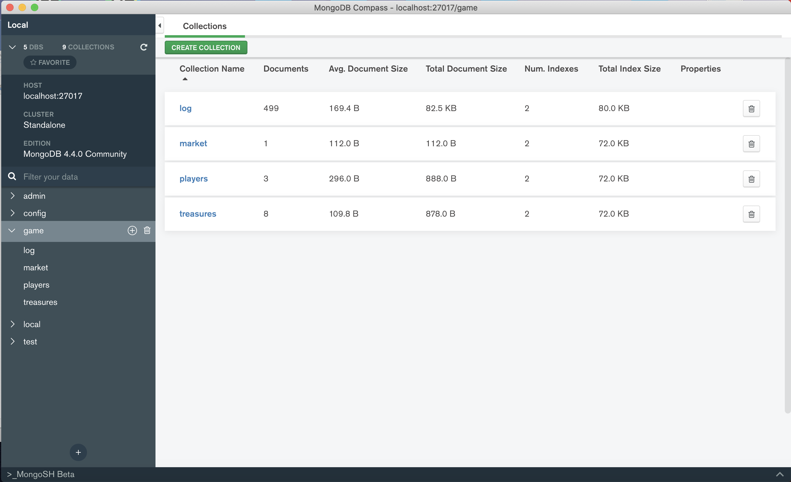

#### players

本文档集储存游戏中所有用户及与其相关的信息，文档集中每个文档对应游戏中的特定玩家。将用户较为频繁访问的数据放在这个数据集中用以减少对其他数据集的访问。**该文档有两个索引，其中一个所创建时建立的以_id为关键字的索引，另一个是以name为关键字的唯一索引。**数据库截图及文档的key和value介绍如下。

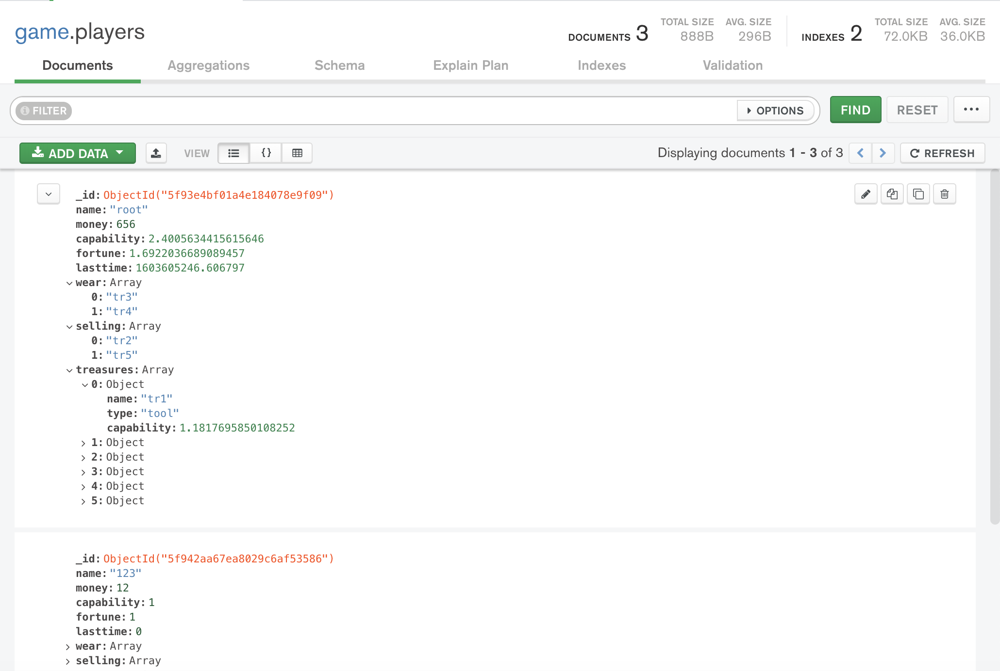

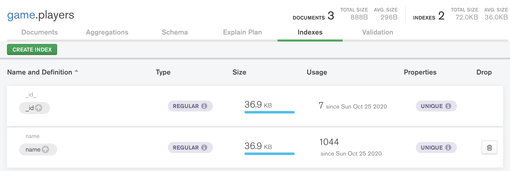

##### _id

ObjectId类型。不可重复，不可修改，由数据库系统自动生成并分配，创建时已经建立索引。记录了玩家在数据库中的ID。

##### name

String类型。不可重复，不可修改，根据这个关键字建立唯一索引。记录了玩家的用户名。

##### money

Int32类型。记录了玩家的金钱数。本游戏中金钱数为整数。

##### capability

Double类型。记录了玩家的工作能力。本游戏中玩家的工作能力等于玩家所佩戴的工具的工作能力，未佩戴工具时其工作能力为1。

##### fortune

Double类型。记录了玩家的运气。本游戏中玩家的运气等于玩家所佩戴的所有配饰的运气之和加1。未佩戴配饰时其运气为1。

##### lasttime

Double类型。记录了玩家上一次工作或寻宝的时间对应的时间戳。以保证每个玩家每天只能工作一次或寻宝一次。为平衡游戏功能及测试，游戏中的一天被设置为10秒钟。

##### wear

Array类型，数组中的元素为String类型。记录了玩家佩戴的所有宝物的名称。玩家最多佩戴一个工具和两个配饰，所以这个数组最大长度为3，其最小长度为0。

##### selling

Array类型，数组中的元素为String类型。记录了玩家挂到市场上售卖的所有宝物的名称。**玩家不可以同时佩戴且售卖同一件宝物。**玩家售卖的宝物数无限制，所以该数组无最大长度，最小长度为0。

##### treasures

Array类型，数组中的元素为字典类型。字典的键值有三个，分别为name，type，capability或fortune。记录了玩家拥有的宝物的简要信息。字典中的三个键值与treasures文档集中对应宝物文档的这三个键值完全相同。玩家拥有的宝物数无限制，所以该数组无最大长度，最小长度为0。

#### treasures

本文档集储存游戏中所有宝物及与其相关的信息，文档集中每个文档对应游戏中的特定宝物。**该文档有两个索引，其中一个所创建时建立的以_id为关键字的索引，另一个是以owner为第一关键字，以name为第二关键字的复合索引。**文档的key和value介绍如下。

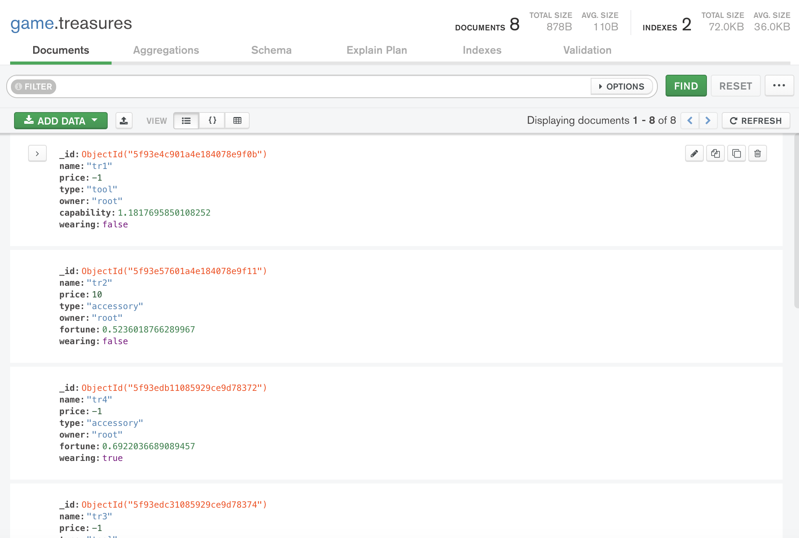

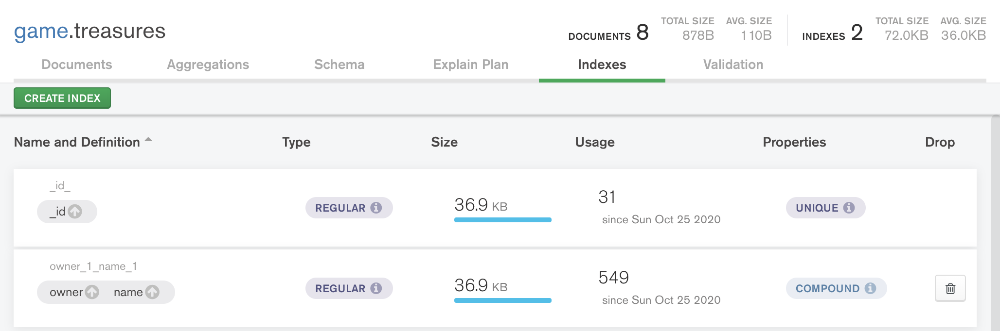

##### _id

ObjectId类型。不可重复，不可修改，由数据库系统自动生成并分配，创建时已经建立索引。记录了宝物在数据库中的ID。

##### name

String类型。理论上不可重复，可以修改，是数据库的主键。记录了宝物的名称。

##### type

String类型，可能的值有两种，分别为tool和accessory。记录了宝物的类型，tool为工具，accessory为配饰。

##### capability

Double类型，只有type对应值为tool的才有此键。记录了工具类宝物的工作能力。

##### fortune

Double类型，只有type对应值为accessory的才有此键。记录了配饰类宝物的运气。

##### owner

String类型。记录了宝物所有者的用户名。

##### wearing

Boolean类型。记录了宝物是否正在被穿戴。若玩家正在穿戴该宝物，则其值为true。若玩家未穿戴该宝物，则其值为false。

##### price

Int32类型。记录了宝物是否被售卖及其价格。若玩家未售卖该宝物，则其值为-1。若玩家正在售卖该宝物，则其值为宝物的价格。

#### market

本文档集储存游戏中正在市场上售卖的所有宝物及与其相关的信息，文档集中每个文档对应市场上的特定宝物。由于用户对于市场的访问较为频繁，所以建立这个文档集加速对市场的访问。**该文档有两个索引，其中一个所创建时建立的以_id为关键字的索引，另一个是price为关键字的索引。**文档的key和value与treasures文档集中的文档对应的key和value含义除_id外完全相同。在这个文档集中，保证每个文档price对应值大于等于0，保证wearing对应的值为false。本数据集保留了wearing键使其与treasures文档集中文档结构完全相同。如此，因这个文档集总文档数目必定小于等于treasures文档集中的文档数目。**所以在取出某个宝物对应的文档时，若已知它正在被售卖，可用此文档集代替treasures文档集查询以降低时间成本。**

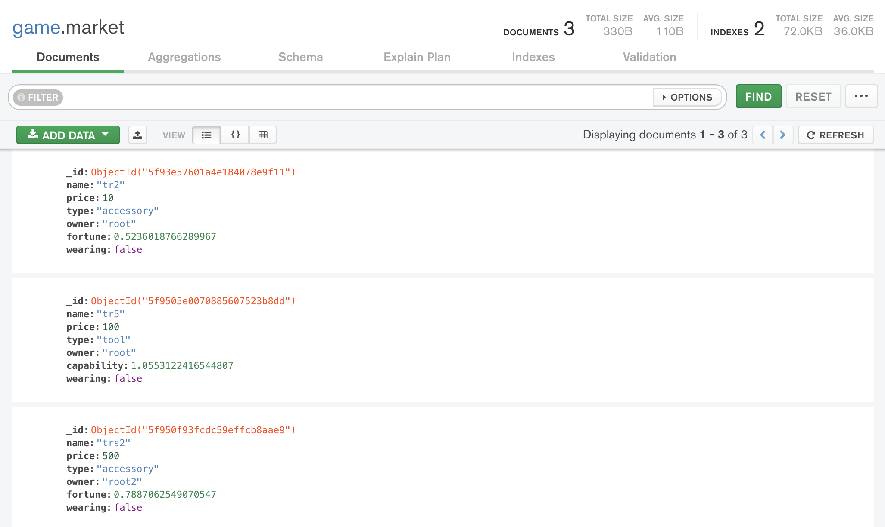

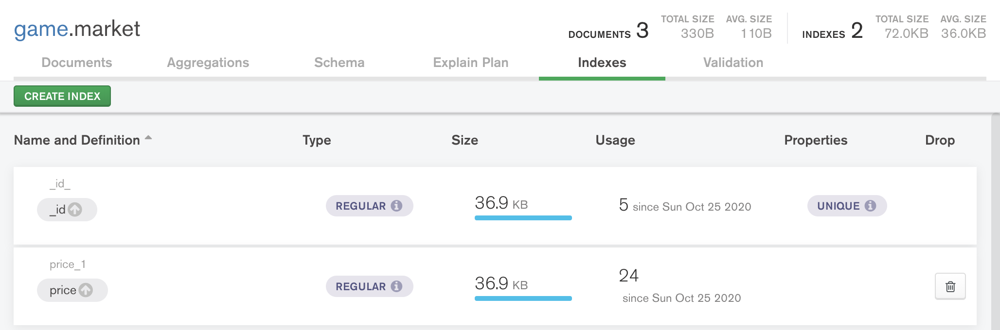

#### log

本文档集储存游戏运行过程中所有的日志。日志记录了自上次清除日志之后所有对数据库进行增加，修改，删除的操作的相关信息。**该文档有两个索引，其中一个所创建时建立的以_id为关键字的索引，另一个是以name为关键字的索引。**一者可以为用户提供查询自己历史操作的功能，二者又可在宕机之后对数据库中的数据进行恢复。日志采用Redo日志，即记录在操作过后用户的相关数据。在某个操作结束时，通过调用`make_log`函数，日志会被写入这个文档集。日志中与player数据集中相同的键名对应的值的含义与player数据集中含义完全相同，其值为进行完该操作后玩家的该项属性。此外，查询数据库的操作一般不会记入日志。若一个操作失败，一般不会修改数据库，这些失败的操作也不会被记入日志。日志中部分之前未出现的键和值对应含义如下。日志中的所有项均不可修改。

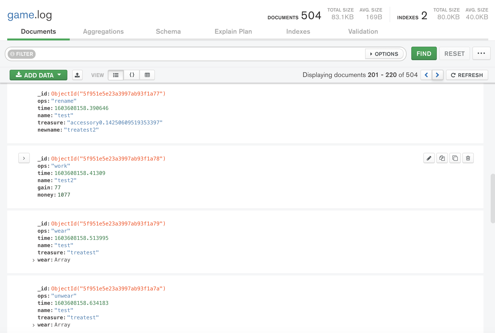

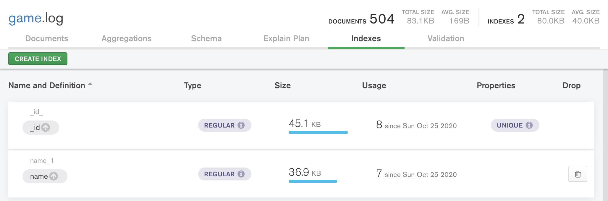

##### _id

ObjectId类型。不可重复，由数据库系统自动生成并分配，创建时已经建立索引。记录了日志在数据库中的ID。

##### ops

String类型。记录了该操作的名称。

##### time

Double类型。记录了该操作执行完成的时间戳。

##### name

String类型。记录了执行该操作的玩家的用户名name。一般来说是这个操作传入的参数。

##### treasure

String类型。记录了执行该操作的宝物的名称name。一般来说是这个操作传入的参数。并非每个日志都有此键。

##### gain

Int32类型。仅在操作ops为work的时候使用。记录玩家一次工作获得的金钱数。

##### buyer和seller

String类型。buyer仅在操作ops为sold的时候使用。seller仅在操作ops为buy的时候使用。这两个参数分别记录一次交易的买卖双方。

##### newname

String类型。仅在操作ops为rename的时候使用。这个参数记录某个宝物在重命名之后的名字。

### 2. 功能设计

游戏的主要功能通过Flask和Blueprint实现，具体路径和函数的实现请查看源代码，这里仅解释主要功能的实现思路。对于效率的优化及考量放在相应函数中讲解。

#### register

该功能路径为`"/<username>/register"`，函数名为`register`，参数为`username`，用于注册新用户。该操作先查询用户名是否注册过，若没有则向数据库中插入该用户。操作成功时访问两次players文档集，一次log文档集。失败时访问一次players文档集。**以下框内为具体程序中的CRUD命令，除第一个功能外不再含插入日志的语句。**

```python
docs = db['players'].find_one({'name': player})
db['players'].insert_one(new_player)
db["log"].insert_one(log)
```

#### work

该功能路径为`"/<username>/work"`，函数名为`work`，参数为`username`，用于完成玩家工作赚钱这一功能。该操作先查找用户是否存在，距离上次工作或寻宝是否超过一天（游戏中）。然后在数据库中修改该用户的钱数。操作成功时访问两次players文档集，一次log文档集。失败时访问一次players文档集。

```python
player = db['players'].find_one({'name':username})
db['players'].update_one({'name':username},{'$set': {'lasttime': time.time()},'$inc':{'money':gain}})
```

#### seek

该功能路径为`"/<username>/seek"`，函数名为`seek`，参数为`username`，用于完成寻宝这一功能。该操作先查找用户是否存在，距离上次工作或寻宝是否超过一天（游戏中）。然后生成并向数据库中插入一个新宝物，并修改该用户的宝物列表。操作成功时访问两次players文档集，一次treasures文档集，一次log文档集。失败时访问一次players文档集。

```python
player = db['players'].find_one({'name': username})
db['treasures'].insert_one(new_tool) # 或 new_accessory
db['players'].update_one({'name': username}, {'$set': {'lasttime': time.time(), 'treasures': player['treasures']}})
```

#### info

该功能路径为`"/<username>/info"`，函数名为`get_user_info`，参数为`username`，用于查询用户与宝物无关的信息，包括玩家的用户名，钱数，工作能力和运气。该操作直接从数据库中查找用户信息。操作成功和失败时均访问一次players文档集。本操作为查询操作，无需插入日志。

```python
player = db['players'].find_one({'name': username})
```

#### treasures

该功能路径为`"/<username>/treasures"`，函数名为`get_my_treasure`，参数为`username`，用于查询用户的宝物相关的信息，包括玩家的穿戴，售卖，拥有的宝物列表。该操作直接从数据库中查找用户信息。操作成功和失败时均访问一次players文档集。本操作为查询操作，无需插入日志。

```python
player = db['players'].find_one({'name': username}, {'_id':0, 'selling': 1, 'wear':1, 'treasures':1})
```

##### treasures_more

该功能为上一功能的扩展。其路径为`"/<username>/treasures/more"`，函数名为`check_my_treasure`，参数为`username`，用于查询用户的宝物相关的更详细的信息，对于每个宝物均列出其详细信息，是否穿戴以及自定价格。该操作从treasures文档集中筛选出某用户拥有的所有宝物的信息。操作成功和失败时均访问一次treasures文档集。本操作为查询操作，无需插入日志。

```python
docs = db["treasures"].find({"owner": username},{"_id": 0})
```

#### market

该功能路径为`"/market"`，函数名为`market`，无参数，用于查询市场里的全部宝物。该操作直接从market中查找全部宝物。操作不会失败，访问一次market文档集。本操作为查询操作，无需插入日志。**特别地，为了防止通货膨胀速度过快，对于每次交易，系统会向买家收取20%的流转税，市场中显示的价格均不含税。**

```python
market = db['market'].find({},{"_id": 0, 'wearing': 0})
```

##### my_market

该功能为上一功能的扩展。其路径为`"/<username>/market"`，函数名为`check_my_market`，参数为`username`，用于从市场中筛选出用户可以购买的宝物。该操作从数据库中查找不属于该用户且该用户可支付得起的宝物。**因为market关键字仅在这个操作中会有筛选的操作，且其关键字主要为price，所以对market数据集建立了以price为关键字的索引。**操作成功时访问一次players文档集和一次market文档集，失败时访问一次players文档集。本操作为查询操作，无需插入日志。

```python
player = db['players'].find_one({'name': username})
market = db['market'].find({'price': {'$lte': money_buy}, 'owner': {'$ne': username}}, {"_id": 0, 'wearing': 0})
```

#### history

该功能路径为`"/<username>/history/<int:number>"`，函数名为`history`，参数为`username,number`，用于查询用户的历史操作。该操作从log文档集中找出用户的日志信息，处理后输出。操作成功和失败时均访问一次log文档集。本操作为查询操作，无需插入日志。

```python
logs = db['log'].find({"name": username}, {"_id": 0, 'name': 0})
```

#### rename

该功能路径为`"/<username>/rename/<treasurename>/<newtreasurename>"`，函数名为`rename`，参数为`username,treasurename,newtreasurename`，用于给宝物重命名。该操作先查找用户，宝物是否存在且可以改名，并查找新宝物名是否已被使用。然后更新该用户的宝物列表和宝物文档集中的宝物名信息。**玩家不能给正在穿戴或售卖的宝物改名。**操作成功时访问两次players文档集，三次treasures文档集，一次log文档集。失败时访问一或二次treasures文档集。

```python
treasure = db['treasures'].find_one({'name': treasurename, 'owner': username})
testtreasure = db['treasures'].find_one({'name': newtreasurename})
player = db['players'].find_one({'name': username})
db['players'].update_one({'name': username},{'$set': {'treasures': player['treasures']}})
db['treasures'].update_one({'name': treasurename}, {'$set': {'name': newtreasurename}})
```

#### wear

该功能路径为`"/<username>/wear/<treasurename>"`，函数名为`wear`，参数为`username,treasurename`，用于穿上宝物。该操作先查找用户，宝物是否存在且未被穿上或上市。然后根据宝物的类别进行更新。若该宝物为工具，则查找并直接替换下原有工具并更新数据库。若该宝物为配饰，则查找出现在已经佩戴的配饰，如果需要更换，则找出运气最小的宝物换下并更新数据库。操作成功时访问两次players文档集，三或四次treasures文档集，一次log文档集。失败时访问一次players文档集，一次treasures文档集。

**在最初的查找用户和宝物是否存在时，先以owner和name为关键字在treasures文档集中进行查找。如果未查找到相应宝物，那么说明用户名错误或宝物名错误或归属关系错误。查找到则说明用户提供的参数全部正确，可以继续判断该宝物可否进行接下来的操作。当确定操作可以完成后，再从players文档集中将用户文档取出并更改。这样只访问一次数据库就可以判断操作是否能够完成。在接下来的操作中，依然会采用这种方法进行错误处理。**

```python
treasure = db['treasures'].find_one({'name': treasurename, 'owner': username})
player = db['players'].find_one({'name': username})
# 若为工具
replacetreasure = db['treasures'].find_one_and_update({'owner': username, 'wearing': True, 'type': 'tool'},  {'$set': {'wearing': False}})
db['treasures'].update_one({'name': treasurename}, {'$set': {'wearing': True}})
db['players'].update_one({'name': username},{'$set': {'capability': treasure['capability'],'wear': wears}})
# 若为配饰
docs = db['treasures'].find({'owner': username, 'wearing': True, 'type': 'accessory'})
db['treasures'].update_one({'name': docs['name']}, {'$set': {'wearing': False}})
db['players'].update_one({'name': username}, {'$set': {'wear': wears}, '$inc':{'fortune': treasure['fortune']-ftn}})
db['treasures'].update_one({'name': treasurename}, {'$set': {'wearing': True}})
```

#### unwear

该功能路径为`"/<username>/unwear/<treasurename>"`，函数名为`unwear`，参数为`username,treasurename`，用于脱下宝物。该操作先查找用户，宝物是否存在且已被穿上。然后更新数据库中用户的已穿戴宝物列表和宝物的穿戴信息。操作成功时访问两次players文档集，两次treasures文档集，一次log文档集。失败时访问一次treasures文档集。

```python
treasure = db['treasures'].find_one({'name': treasurename, 'owner': username})
player = db['players'].find_one({'name': username})
db['treasures'].update_one({'_id': treasure['_id']}, {'$set': {'wearing': False}})
# 若为工具
db['players'].update_one({'name': username}, {'$set': {'capability': 1, 'wear': wears}})
# 若为配饰
db['players'].update_one({'name': username}, {'$set': {'wear': wears}, '$inc': {'fortune': -treasure['fortune']}})
```

#### sell

该功能路径为`"/<username>/sell/<treasurename>/<int:price>"`，函数名为`sell`，参数为`username,treasurename,price`，用于将宝物挂牌售卖。该操作先判断价格是否为正，再查找用户，宝物是否存在且未被穿上。然后更新数据库中用户的已挂牌宝物列表和宝物的挂牌信息，并将其加入市场。此外，若想修改宝物的价格，也可直接使用此操作，这样无需更新用户的已挂牌宝物列表。操作成功时访问一或二次players文档集，两次treasures文档集，一次market文档集，一次log文档集。失败时不访问或访问一次treasures文档集。

```python
treasure = db['treasures'].find_one({'name': treasurename, 'owner': username})
player = db['players'].find_one({'name': username})
# 若为新上市
db['players'].update_one({'name': username}, {'$set': {'selling': player['selling']}})
db['market'].insert_one(treasure)
# 若为修改价格
db['market'].update_one({'name': treasurename},{'$set': {'price': price}})
# 新上市或修改价格
db['treasures'].update_one({'name': treasurename},{'$set': {'price': price}})
```

#### callback

该功能路径为`"/<username>/callback/<treasurename>"`，函数名为`callback`，参数为`username,treasurename`，用于将宝物收回。该操作先判断用户是否存在，宝物是否在市场里。然后从市场中删除宝物并更新宝物价格标志和用户的已挂牌宝物列表。操作成功时访问两次players文档集，一次treasures文档集，一次market文档集，一次log文档集。失败时访问一次market文档集。

```python
treasure = db['market'].find_one_and_delete({'name': treasurename, 'owner': username})
player = db['players'].find_one({'name': username})
db['treasures'].update_one({'name': treasurename}, {'$set': {'price': -1}})
db['players'].update_one({'name': username}, {'$set': {'selling': player['selling']}})
```

#### sold

该功能路径为`"/<username1>/sold/<treasurename>/<username2>"`，函数名为`sold`，参数为`username1,username2,treasurename`，用于一个玩家向另外一个玩家购买宝物，是最复杂的操作之一。**该操作先判断用户是否存在，然后直接从市场中删除宝物。这样一者可防止其他玩家继续购买该宝物，二者可以降低成功时访问市场的次数，即合并了查询和删除的操作。如果没有相应宝物，删除操作也不会生效。若操作失败则重新向市场中加入该宝物用以恢复。**然后更新宝物信息及买卖双方的信息。（此操作还有一个彩蛋）操作成功时访问三次players文档集，一次treasures文档集，一次market文档集，两次log文档集。失败时最多访问一次players文档集，两次market文档集。

```python
treasure = db['market'].find_one_and_delete({'name': treasurename})
players = db['players'].find({'$or': [{'name': username1}, {'name': username2}]})
db['market'].insert_one(treasure) # 若购买失败
db['players'].update_one({'name': player1['name']},{'$set': {'treasures': player1['treasures'], 'selling': player1['selling']},'$inc': {'money': treasure['price']}})
db['players'].update_one({'name': player2['name']},{'$set': {'treasures': player2['treasures']}, '$inc': {'money': -realprice}})
db['treasures'].update_one({'name': treasurename}, {'$set': {'owner': username2, 'price': -1}})
```

#### drop

该功能路径为`"/<username>/drop/<treasurename>"`，函数名为`drop`，参数为`username,treasurename`，用于丢弃宝物。该操作先判断用户是否存在，宝物是否可被丢弃。然后从用户的宝物列表和treasures文档集中删除这个宝物。**玩家不能丢弃正在穿戴或售卖的宝物。**操作成功时访问两次players文档集，两次treasures文档集，一次log文档集。失败时访问一次treasures文档集。

```python
treasure = db['treasures'].find_one({'name': treasurename, 'owner': username})
player = db['players'].find_one({'name': username})
db['treasures'].delete_one({'name': treasurename, 'owner': username})
db['players'].update_one({'name': username}, {'$set': {'treasures': player['treasures']}})
```

#### remove

该功能路径为`"/<username>/remove"`，函数名为`remove`，参数为`username`，用于注销账号。该操作先删除用户并且删除他的宝物和挂牌的宝物。操作成功时访问一次players文档集，一次treasures文档集，一次market文档集，一次log文档集。失败时访问一次players文档集。

```python
player = db["players"].find_one_and_delete({"name": username})
db["market"].delete_many({"owner": username})
db["treasures"].delete_many({"owner": username})
```

### 3. 前端设计

在本次实验中，我编写了了简易的前端。前端代码使用了json和表单来传递数据，所以在route.py中有专门为前端提供的使用表单传递除username外所有参数的路径。不过，无论是否使用前端，程序在与数据库交互时运行的还是上一节所描述的代码。所以本节仅介绍专门给前端提供的接口和代码。部分使用前端页面进行操作时返回的json信息如下图。

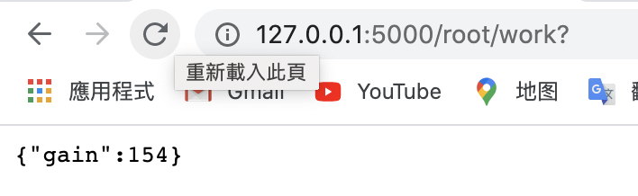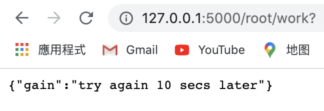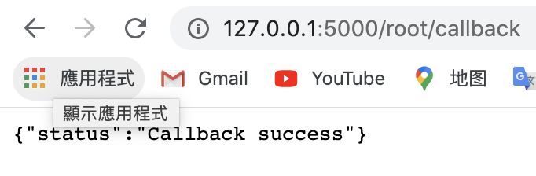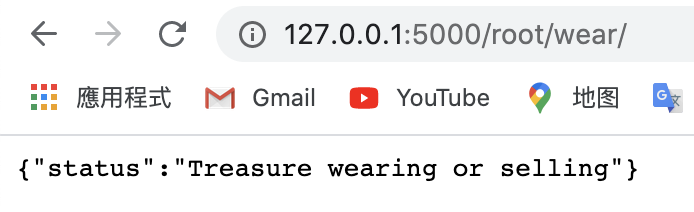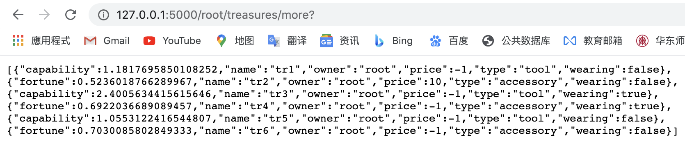

#### index

该路径为`"/"`，无参数，用于显示登陆及注册页面。如下图所示。

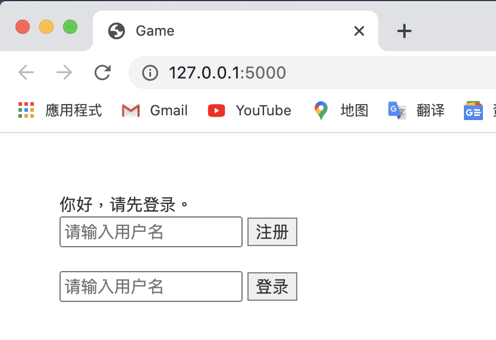

#### signup

该功能路径为`"/signup"`，参数为`username`，通过表单传入，用于注册账号。该操作会调用`register`函数并访问数据库。

#### login

该功能路径为`"/login"`，参数为`username`，通过表单传入，用于登录账号并显示该账号对应的operation.html页面。该操作会调用`isplayer`函数并访问一次players文档集。

#### operation

该功能路径为`"/operation/<string:username>"`，参数为`username`，用于显示用户可执行的各种操作。页面上每个按钮对应一个操作的链接。如下图所示。

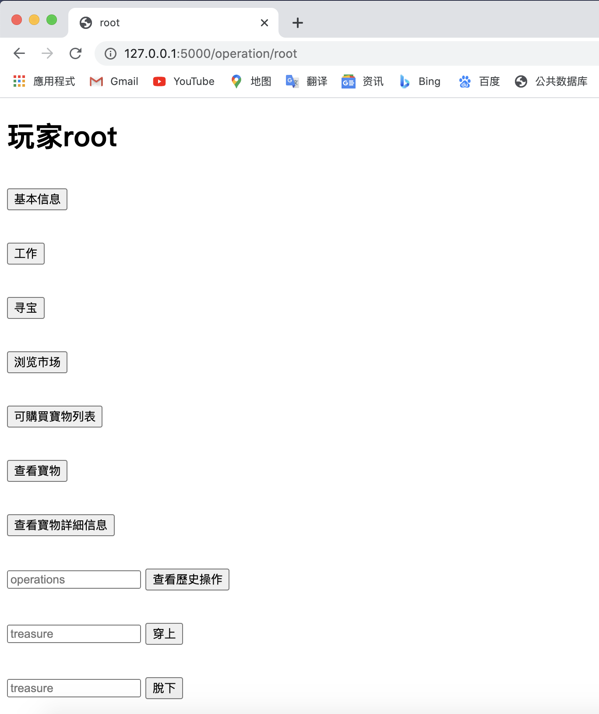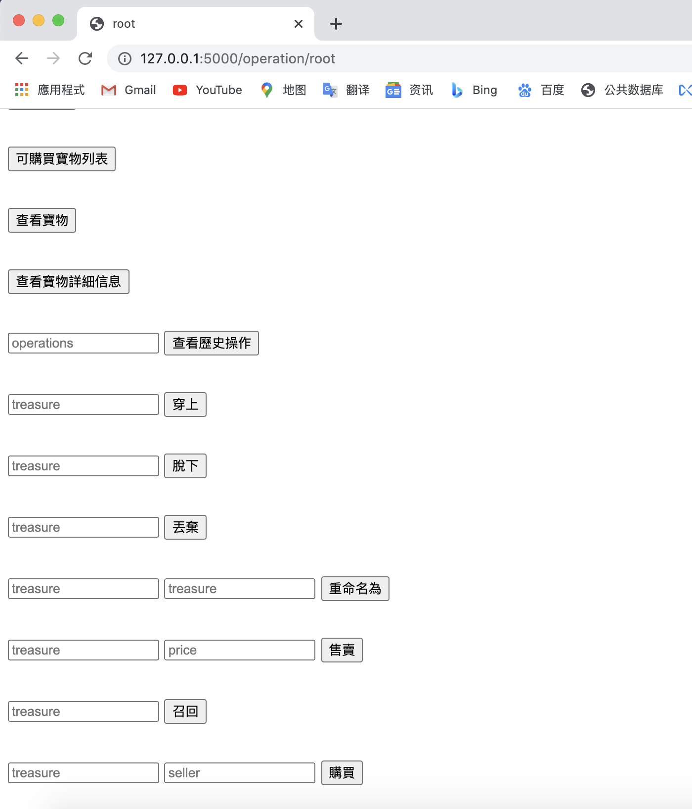

### 4. 测试设计

#### pytest测试

在我的代码中，我使用了pytest进行测试并计算覆盖率。由于前端网页专用的接口同样运行后端的代码，功能重复。所以没有计算前端网页专用的接口，此时覆盖率如图所示。

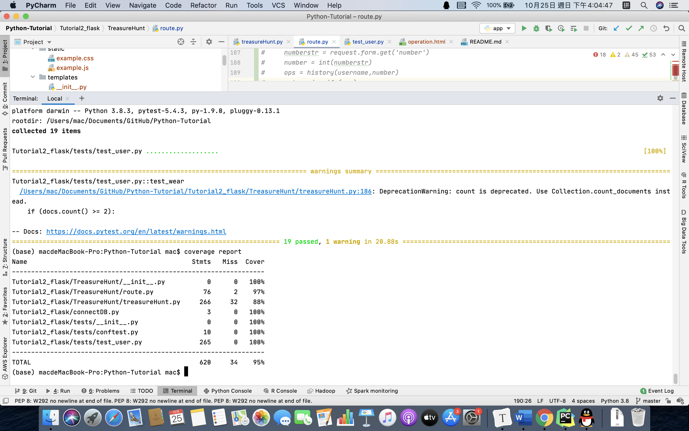

##### 插入类功能测试

对于`register, seek, work`这类将某项加入数据库的功能的测试主要在`test_register, test_seek_and_rename, test_work, test_wrong_1`中。主要测试了注册成功，注册时重名，寻宝工具成功，寻宝配饰成功，工作成功，距离上次工作或寻宝未满一天，用户名错误等场景。

##### 查找类功能测试

对于`info, treasures, market`等需要返回具体信息的功能的测试主要在`test_info, test_market, test_treasures, test_more_treasures, test_my_market, test_wrong_1`中。主要测试了以下场景：查看基本信息成功，查看市场成功，查看宝物成功，查看宝物详细信息成功，筛选可购买宝物成功，查看历史记录成功，以及各种因用户名错误而失败的各种场景。这类操作属于查询信息，即使失败仍然有可能返回有用信息或空列表。

##### 修改类功能测试

对于`rename, wear, unwear, sell, callback, sold`等需要大量修改数据库内信息的功能的测试主要在`test_wear, test_unwear, test_sell, test_callback, test_buy, test_seek_and_rename, test_wrong_2, test_wrong_3`中。主要测试了以下场景：改名成功，宝物名已被使用，穿戴工具类宝物成功，穿戴配饰类宝物成功，脱下宝物成功，重复穿戴宝物失败，脱下未穿戴的宝物失败，上架已穿戴的宝物失败，更名已穿戴宝物失败，上架宝物成功，下架宝物成功，穿上已挂牌宝物失败，更名已上架宝物失败，更改宝物价格，购买宝物成功，金钱不足购买失败，购买自己宝物失败以及各种因用户名不存在，宝物不存在，宝物不属于该用户而失败的各种场景。

##### 删除类功能测试

对于`drop, remove`等不可撤销地从数据库中删除一个或几个文档的测试主要在`test_drop, test_remove, test_wrong_2, test_wrong_3`中。主要测试了以下场景：丢弃宝物成功，丢弃已穿戴宝物失败，丢弃已上市宝物失败，注销账号成功，注销不存在的账号失败以及各种因用户名不存在，宝物不存在，宝物不属于该用户而失败的场景。

#### postman测试

除pytest以外，我还使用了postman对一些不易被测试到的情形进行了测试。以下是部分测试的截图。按顺序执行以下操作对查询类操作和特殊情形进行测试。

下图是查询我的宝物测试，返回的数据格式如图。可以看到此时穿着两件配饰一件工具。

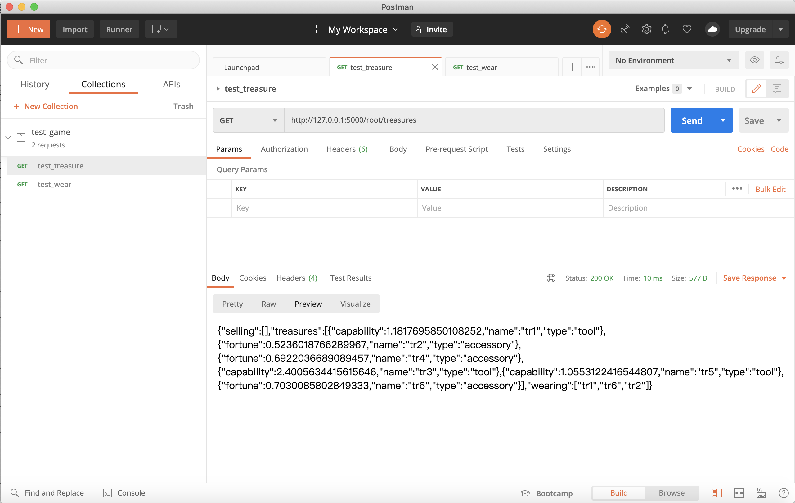

然后穿上宝物tr4，返回状态为成功。

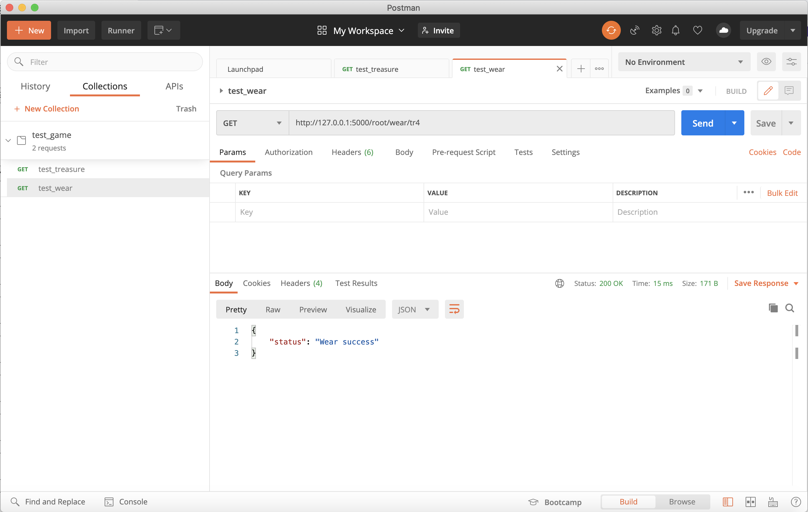

测试显示宝物详细信息功能。可以看到宝物tr4替换了原来运气值最小的tr2宝物。

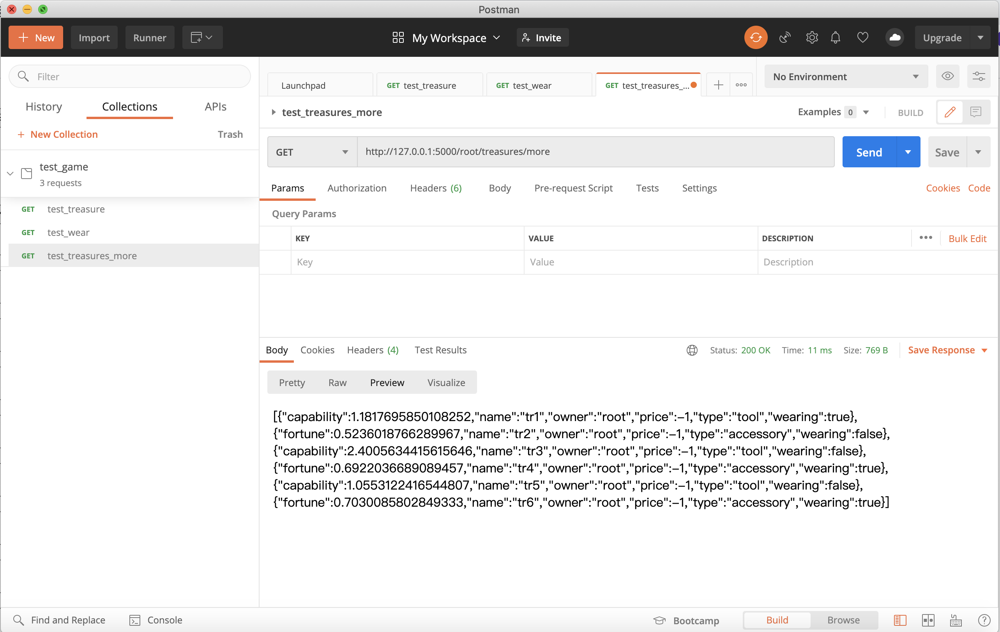

然后测试穿戴工具宝物tr3。

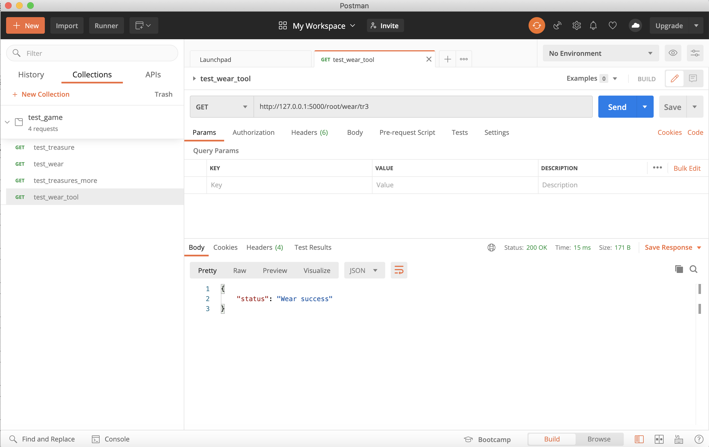

测试日志功能，日志格式如图。可以看到工具tr3替换了原有的工具tr1。

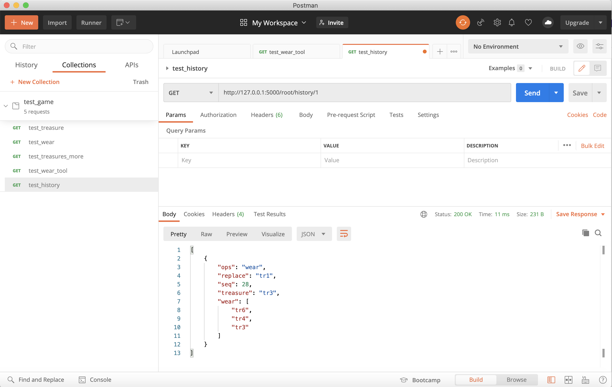

测试显示可购买宝物功能，返回格式如图。显示的价格为500金钱。

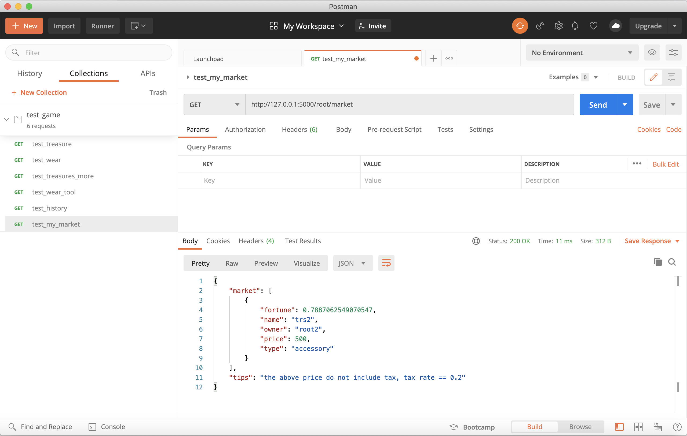

测试显示基本信息功能，返回格式如图。金钱充足可以购买。

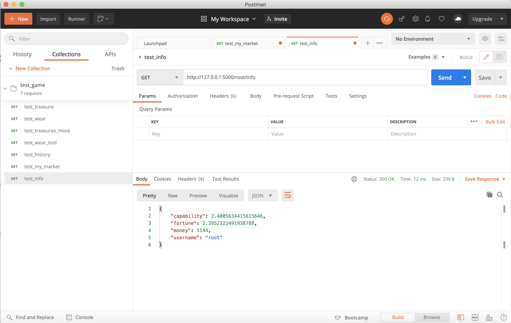

测试购买功能，显示购买成功。

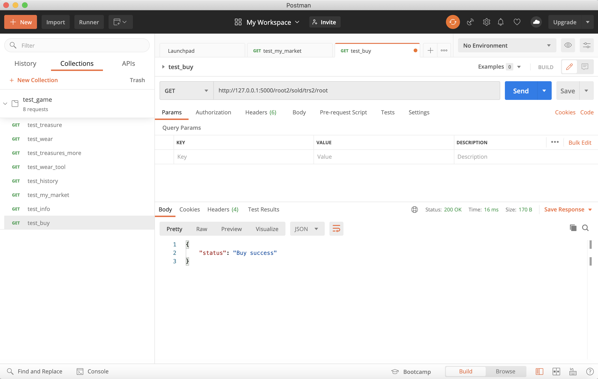

查看日志发现确实购买成功，金钱减少600是因为有20%流转税的缘故，在市场页面有说明。

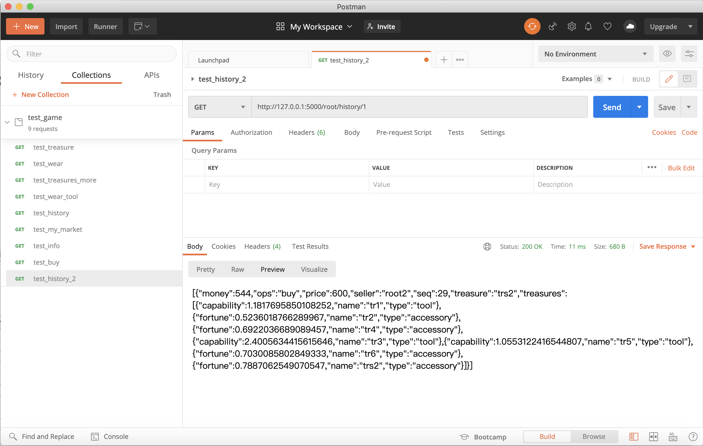

## 五、总结

通过这次实验，我学会了使用MongoDB搭建一个项目。在这个项目中，我熟练使用了MongoDB的CRUD操作，并且学会了利用pymongo中提供的函数来进行增删改查。现在，我对于文档型数据库有了更深刻的体会。

在本次实验中，我收获最多的是对于后端性能的优化上。对于同样的操作，访问数据库的次数可以有很大的差异。而数据库的规模往往很大，每次访问需要付出较大的时间成本。为了优化性能，我认为比较好的方法有以下几点。**一者对于冗余的数据，尽量从规模较小的数据库中取出。二者对于在同一个数据库中的数据，有时可以一次性取出再将所需数据分开。三者在进行错误处理时，要尽量选择较少访问数据库的方式。四者可以使用pymongo提供的查找并更新，查找并删除等操作。**这样可以减少访问数据库的次数或减少单次访问数据库的时间，才能在不损失功能的情况下尽量提高性能。

同时，我进一步理解了老师课上所讲的数据库系统**功能和性能的对立统一**。要实现某个功能，就要维护更多数据，牺牲一部分性能。要提高性能，就有一些功能可能兼顾不到。如日志功能对于每次非查询类的操作都增加了一次对数据库的访问，但它对用户的使用和数据的恢复有重要的作用。

由于时间和水平有限，本项目还存在许多不足之处，万望海涵。最后，感谢牛学长百忙之中的指导，感谢老师和助教们的日复一日不辞辛劳的讲解和付出，您们辛苦了，谢谢您们！