# 华东师范大学数据科学与工程学院实验报告

| 课程名称：当代数据管理系统             | **指导教师**：周烜 | 上机实践成绩：                    |
| -------------------------------------- | ------------------ | --------------------------------- |
| **年级**：2018级                       | **姓名**：郑佳辰   | **学号**：10182100359             |
| **上机实践名称**：用PostgreSQL构建游戏 |                    | **上机实践日期**：2020/11/24-12/6 |

## 一、实验目的

熟悉关系型数据库的使用，学会用Python连接PostgreSQL，学习使用sqlalchemy。熟练使用SQL的insert, select, update, delete等操作，学习使用ORM工具管理对象和关系之间的映射。了解数据库该如何组织，学习Flask框架和pytest测试。

## 二、实验任务

考虑以下游戏场景：

1. 每个游戏玩家都有一定数量的金币、宝物。有一个市场供玩家们买卖宝物。玩家可以将宝物放到市场上挂牌，自己确定价格。其他玩家支付足够的金币，可购买宝物。

2. 宝物分为两类：一类为工具，它决定持有玩家的工作能力；一类为配饰，它决定持有玩家的运气。

3. 每位玩家每天可以通过寻宝获得一件宝物，宝物的价值由玩家的运气决定。每位玩家每天可以通过劳动赚取金币，赚得多少由玩家的工作能力决定。（游戏中的一天可以是现实中的1分钟、5分钟、10分钟。自主设定。）

4. 每个宝物都有一个自己的名字（尽量不重复）。每位玩家能够佩戴的宝物是有限的（比如一个玩家只能佩戴一个工具和两个配饰）。多余的宝物被放在存储箱中，不起作用，但可以拿到市场出售。

5. 在市场上挂牌的宝物必须在存储箱中并仍然在存储箱中，直到宝物被卖出。挂牌的宝物可以被收回，并以新的价格重新挂牌。当存储箱装不下时，运气或工作能力值最低的宝物将被系统自动回收。
6. 假设游戏永不停止而玩家的最终目的是获得最好的宝物。

请根据以上场景构建一个假想的Web游戏，可供多人在线上玩耍。界面尽可能简单。后台的数据库使用PostgreSQL。对游戏玩家提供以下几种操作：寻宝、赚钱、佩戴宝物、浏览市场、买宝物、挂牌宝物、收回宝物。

## 三、使用环境

Pycharm 2020.2.1

Python 3.6

PostgreSQL 13.0

pgAdmin 4.26

Postman 7.34.0

macOS 10.15.7

## 四、实验过程

**实验报告阅读指南：**本实验报告字数和页数较多。重要内容位置如下。数据库设计，包括逻辑设计，物理设计，范式化在下方四.1.数据库设计中。ER图和关系模式也在下方四.1.数据库设计中。与上次实验相比的重要更新在报告末尾五、总结中。代码运行方法在四.4.测试设计结尾。数据库访问的SQL指令在四.2.功能设计中。

### 1. 数据库设计

本次实验的数据库为postgresql，共有players, treasures, logs, logs_overflow共4张表，此外还包括必要的索引以及视图。**数据库和文档集的设计基于以下合理假设：** *玩家会频繁访问与自己有关的信息；玩家会频繁访问市场；玩家一般会自己最大化自己的属性；玩家一般不会故意输入错误参数（即对于同一操作，假设失败次数小于成功次数）。*

####  逻辑设计

在我的逻辑设计中，三个实体分别为用户，宝物和日志。用户和宝物之间有拥有这一一对多联系，用户和日志之间有生成这一一对多联系，三个实体之间有生成这一三元联系。用户的用户名为唯一属性，在图中有下划线表示。日志的其他参数为多值属性，用两个圆圈表示。其余属性均为单值属性。价格属性可以为空。宝物下分工具和配饰两个弱实体。用户和宝物之间还有穿戴和售卖这两个弱联系。数据库的ER图如下图所示。

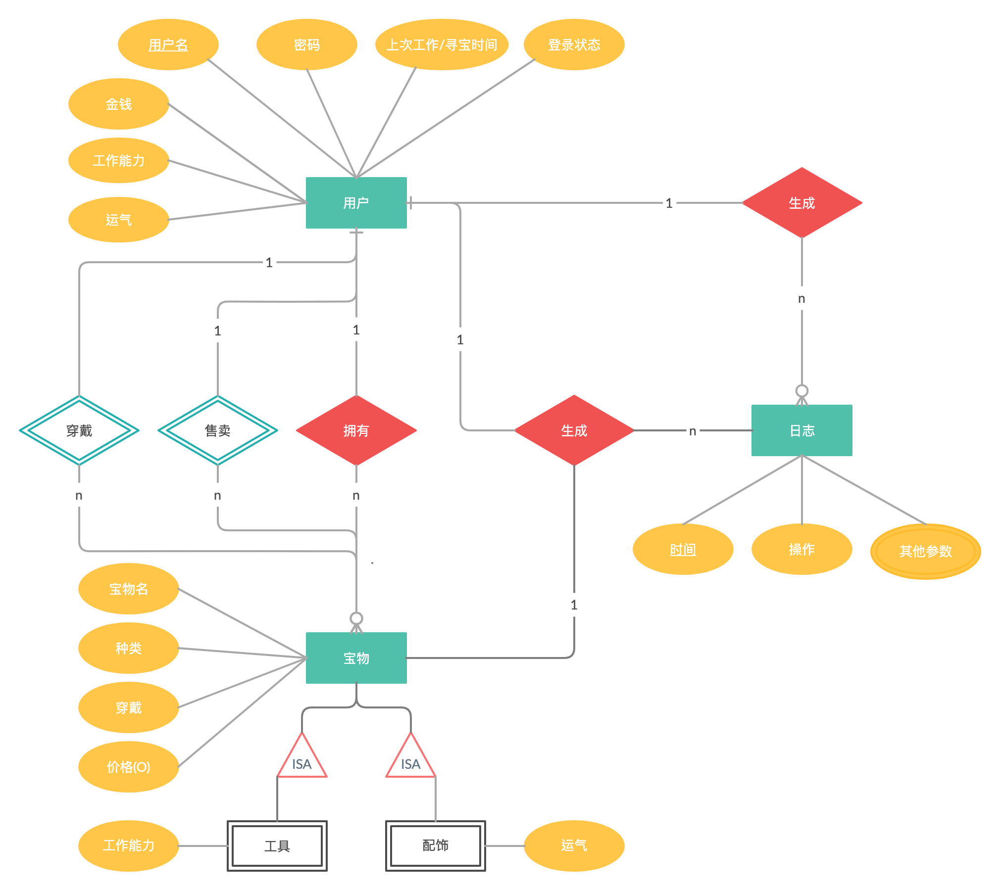

#### 范式化

players表中的函数依赖包括：pname -> passwd, money, capability, fortune, lastime, login。treasures表中的函数依赖包括：tname, owner -> type, value, wearing, price。logs表中的函数依赖包括 time -> ops, pname, tname。logs_overflow表中的函数依赖包括：time, attr -> value。可以看出，前一项均为表的主码，其他每个属性都由码直接决定。在这个关系中，每个决定因素都包含码，所以该关系模式符合扩充的第三范式BCNF。同时，该关系模式属性间不存在非平凡且非函数依赖的多值依赖，符合第四范式4NF。所以该数据模式同时符合4NF，BCNF，3NF，2NF，1NF。最高可满足4NF，设计非常规范。

#### 物理设计

首先，当前关系查询起来很方便，不必添加更多冗余属性。对于logs中attr和value这一对多值属性，建立logs_overflow表存储。由于pname和tname长度并不是太大，所以没有设置代理健。严格来说，玩家的工作能力和运气属于推导属性。market与treasures中重复内容较多，所以没有建立物化表。每张表本身已经足够窄，不需要继续分裂表。对于tool和accessory这两个子类，由于非常相似且接口几乎完全相同，所以选择存在一张表中。

除4张表主键外，由于在市场功能下经常使用价格筛选，所以用价格在treasures表上构建索引。在历史记录功能下经常使用用户名筛选，所以用用户名在logs表上构建索引。

#### players表

本表储存游戏中所有用户及与其相关的信息，表中每行对应游戏中的特定玩家。**该表的主码是pname，索引为主码对应的唯一索引。**JSON格式的表结构及数据库截图如下。之后是表中每一列的介绍。

```json
{
  pname: string(64),
  passwd: string(32),
  money: integer,
  capability: real,
  fortune: real,
  lasttime: numeric(16,6),
  login: boolean
}
```

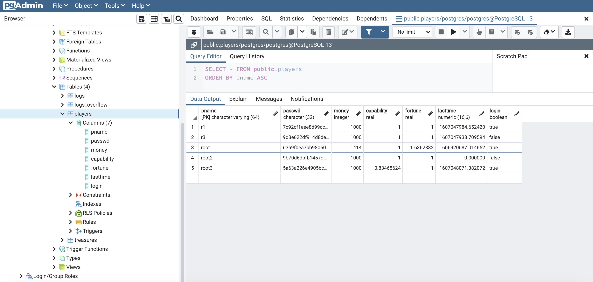

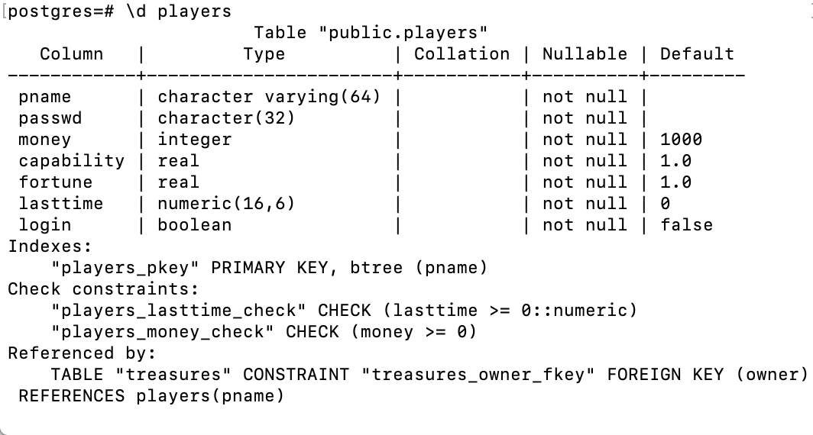

##### pname

String类型，最大长度为64。为players表的主码，不可重复，不可修改，根据本关键字建立唯一索引。记录了玩家的用户名。**以下如无特殊说明，则该列不能为空。**

##### passwd

String类型，最大长度为32。用于记录玩家的密码。**数据库不存储密码明文。**本列存储的是经加密后的密文。

##### money

Integer类型。记录了玩家的金钱数。本游戏中金钱数为整数，初始值为1000。

##### capability

Real类型。记录了玩家的工作能力。本游戏中玩家的工作能力等于玩家所佩戴的工具的工作能力，未佩戴工具时其工作能力为1.0。

##### fortune

Real类型。记录了玩家的运气。本游戏中玩家的运气等于玩家所佩戴的所有配饰的运气之和加1。未佩戴配饰时其运气为1.0。

##### lasttime

Numeric类型，共16位，整数部分10位，小数点后6位，初始值为0。记录了玩家上一次工作或寻宝的时间对应的时间戳，以保证每个玩家每天只能工作一次或寻宝一次。为平衡游戏功能及测试，游戏中的一天被设置为10秒钟。

**在本游戏中，时间戳均用numeric(16,6)类型存储。**原因如下。游戏中，存储的时间会作为表的主码之一。如采用Real或Double Precision类型存储，则精度的不足可能导致时间戳不唯一，或导致运算结果出错。如采用Time, Timestamp类型进行存储，由于这一属性并不需要展示给用户，且不方便进行运算，会导致效率较低等问题。所以在数据库中采用了定点数进行存储，运算简单且精度高。

##### login

Boolean类型，初始值为False。记录玩家是否已经登陆。True代表已登陆，False代表未登陆。在本游戏中，部分重要操作只有在登陆后才可进行。

#### treasures表

本表储存游戏中所有宝物及与其相关的信息，表中每行对应游戏中的特定宝物。工具和配饰这两个子类都被存在这张表中。**该表主码为owner和tname。有两个索引，其中一个是主码对应的以owner为第一关键字，以tname为第二关键字的复合索引。另一个是以price的升序建立的索引。**JSON格式的表结构及数据库截图如下。之后是表中每一列的介绍。

**重要更新：**在本游戏中，每个宝物都是唯一的。同一玩家不能拥有两件同名的宝物。但允许不同玩家拥有名字相同的两件宝物。这两件宝物其他属性可能均不相同，是两件不同的宝物。当宝物的名称或拥有者变动时，系统会检查是否符合主码约束。若不符合则无法进行此操作。此外，一件宝物无法同时被穿戴且被售卖。但可以在被穿戴或被售卖之时改名或被丢弃。**这与MongoDB版本的游戏规则是不同的。**

```json
{
  tname: string(64),
  type: string(10),
  value: real,
  owner: string(64),
  wearing: boolean,
  price: integer
}
```

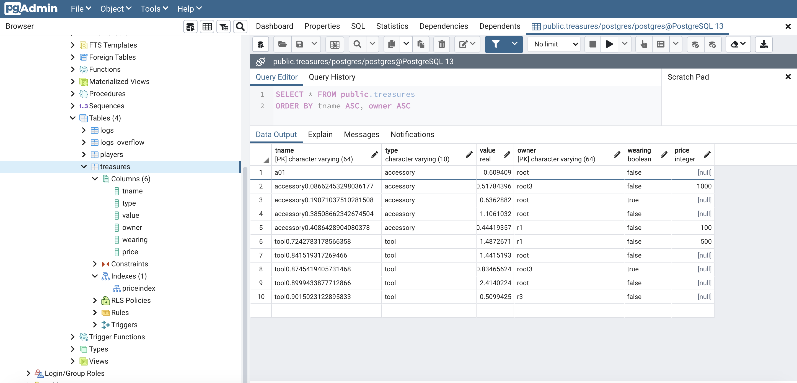

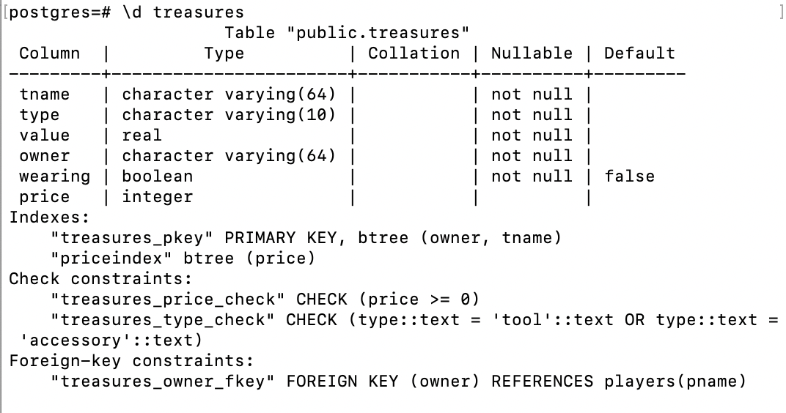

##### tname

String类型，最长64位。可重复且可以修改，是表的主键之一。记录了宝物的名称。

##### type

String类型，最长10位，不可修改。可能的值有两种，分别为tool和accessory。记录了宝物的类型，tool为工具，accessory为配饰。

##### value

Real类型，不可修改。若type对应值为tool，则记录工具类宝物的工作能力。若type对应值为accessory，则记录了配饰类宝物的运气。**由于一个宝物不会同时具有工作能力和运气，所以将这两个属性存储在同一列中。**

##### owner

String类型，最长64位。可重复且可以修改，是表的主键之一。记录了宝物所有者的用户名。

##### wearing

Boolean类型，初始值为False。记录了宝物是否正在被穿戴。若玩家正在穿戴该宝物，则其值为True。若玩家未穿戴该宝物，则其值为False。

##### price

Integer类型，**可以为空**，初始值为空值。记录了宝物是否正在被售卖及其价格。若玩家未售卖该宝物，则其值为空值NULL。若玩家正在售卖该宝物，则其值为宝物的价格。

#### logs表

本表储存游戏运行过程中所有的日志。日志记录了自上次清除日志之后用户所有对数据库进行增加，修改，删除的操作的简要信息。**该表主码为time。有两个索引，其中一个是主码对应的以time为关键字的索引，另一个是以pname为关键字的索引。**该功能一者可以为用户提供查询自己历史操作的功能，二者又可在宕机之后对数据库中的数据进行恢复。日志采用Redo日志，即在操作过后记录相关数据。在某个操作结束时，通过调用`make_log`函数，日志会被写入这个表，可能同时用到logs_overflow表。查询数据库的操作一般不会记入日志。若一个操作失败，一般不会修改数据库，这些失败的操作也不会被记入日志。JSON格式的表结构及数据库截图如下。之后是表中每一列的介绍。注意本表中的所有项均不可修改。

```json
{
  ops: string(10),
  time: numeric(16,6),
  pname: string(64),
  tname: string(64),
  overflow: boolean
}
```

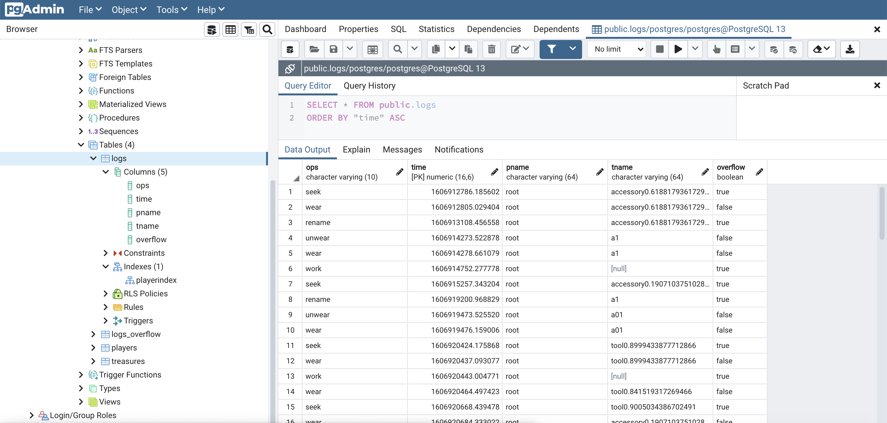

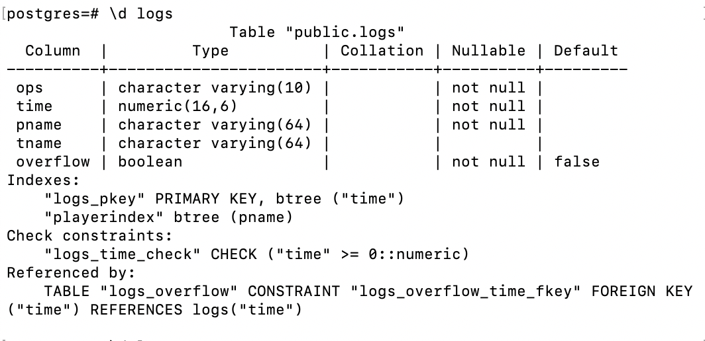

##### ops

String类型，最长10位。记录了该操作的名称。

##### time

Numeric类型，共16位，整数部分10位，小数点后6位，初始值为0。是这张表的主键，记录了该操作执行完成的时间戳。**经过测试，由于存取数据库需要大量时钟周期，取得的时间戳可以保证每条日志的时间戳唯一。**

##### pname

String类型，最长64位。记录了执行该操作的玩家的用户名pname。一般来说是这个操作传入的参数。

**这一列没有设置外键约束。**原因如下。对于已经注销的用户，其日志数据对游戏发行方仍有价值，不宜直接删除。此时对应的pname已经不在players表中，此时不满足外键约束。对于接下来的tname属性，由于改名功能的存在，也不宜设置外键约束。

##### tname

String类型，最长64位，**可以为空**。记录了执行该操作的宝物的名称tname。一般来说是这个操作传入的参数。本列未设置外键约束，原因同上。

##### overflow

Boolean类型，初始值为False。记录了本日志是否用到logs_overflow表来存储其它需要记录的属性。若用到了该表，则其值为True，否则其值为False。logs_overflow表的具体介绍如下。

#### logs_overflow表

本表储存游戏运行过程中日志的其他属性。**该表主码为time。索引为主码对应的以time为关键字的索引。**JSON格式的表结构及数据库截图如下。之后是表中每一列的介绍。注意本表中的所有项均不可修改。

**建立此表的原因如下。**对于大部分日志来说，只记录用户名和宝物名已经足够。但还有部分操作涉及其他属性需要记录。这些属性个数不确定，名称各不相同。若对每个属性都在logs表中建立一列，则logs表会变得宽而稀疏。提高了存储空间，降低了查询效率。考虑到历史记录功能对用户来说用途有限，所以建立此表存储日志除操作名，用户名，宝物名，时间之外的其他属性。这样既不会使效率降低太多，还使logs表变窄，降低存储空间。

```json
{
  time: numeric(16,6),
  attr: string(64),
  value: string(64)
}
```

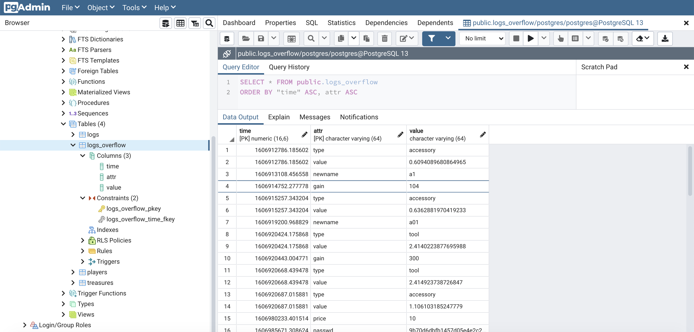

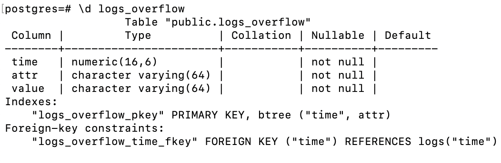

##### time

Numeric类型，同上表中的time列。是这张表的主键。

##### attr

String类型，最长64位。记录了某条日志对应属性的属性名。可能出现的操作及属性包括：注册时的密码密文passwd，工作时的收入gain，寻宝时宝物的类别type和价值value，售卖时的价格price，卖出时的买卖双方seller&buyer，改名时的新名字newname，改密码时的密码密文newpw等。

##### value

String类型，最长64位。记录了属性名对应的值。如果不是字符串类型，则转换为字符串再进行存储。

#### market视图

本视图选取出游戏中正在市场上售卖的所有宝物及与其相关的信息，视图中每行对应市场上的特定宝物。由于用户对于市场的访问较为频繁，所以建立这个视图加速对市场的访问。同时，判断宝物是否被售卖是利用价格是否为空判断的。以price为关键字的建立在treasures上的索引可以加速这个视图的查询。**在进行选择和更新时，由于同样是从treasures表中选取文件，所以有些情况下market和treasures可以混用。**

**这里没有采用物化表，即建立一张真正的表。**原因如下。market中数据在treasures中占比较大，会有大量冗余。而且更新频繁，维护复杂度高。建立新表后遍历时的复杂度比遍历原表不会小太多。所以为了效率考虑，不建立物化表。

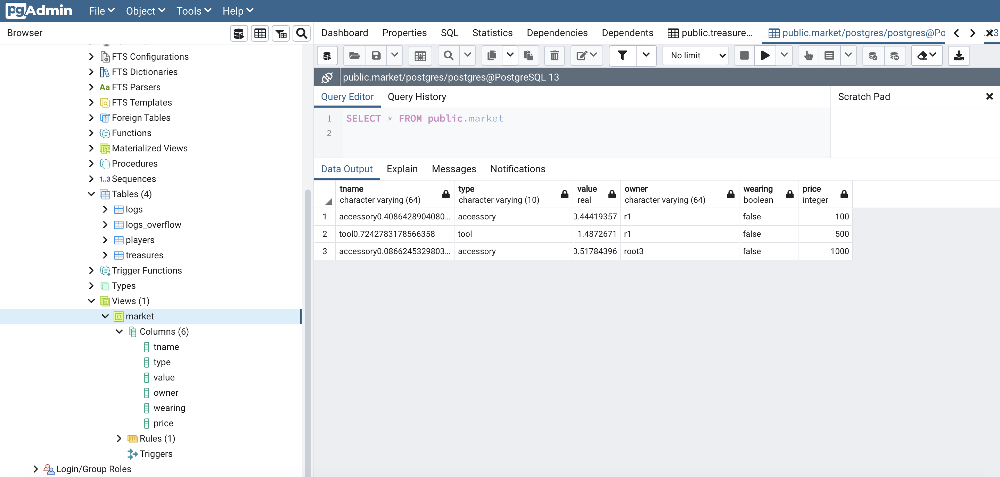

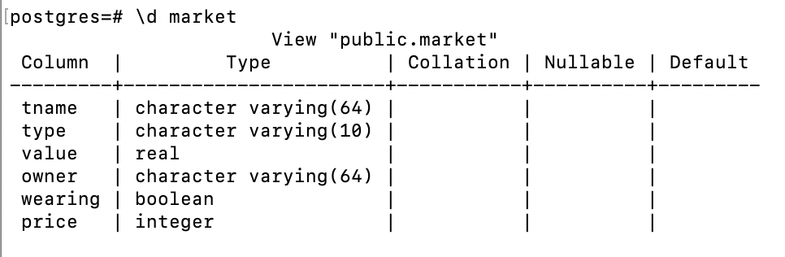

### 2. 功能设计

游戏的主要功能通过Flask和Blueprint实现，具体路径和函数的实现请查看源代码，这里仅解释主要功能的实现思路。对于效率的优化及考量放在相应函数中讲解。

**本部分实验报告的各个功能的实现思路与上次实验报告大致相同。新增加的部分为数据库访问，changepw，login，logout。其余大部分仅修改程序框中的语句和表的访问次数。**

#### 数据库访问

在我的代码里，**使用SQLAlchemy Core而非SQLAlchemy ORM来对数据库进行访问。**原因如下。使用SQLAlchemy Core更接近原始的SQL语句，可以根据自己的需要灵活选择对数据库的访问方式。并且在后续优化时可以更加精准地修改查询语句。缺点是访问的操作和返回的结果需要进行进一步处理，才能较为方便的进行使用。

同样基于以上原因，**我编写了以下数据库接口函数。**这样便于从数据库中插入、查询或修改数据。这样在之后的功能中，只需调用这些函数，就可以取出特定的数据。这样得到的代码模块化较好，但是可能略微影响效率。这些函数可以将数据转化为字典形式，这样就可以用类似文档型数据库的方式查找并更新数据。

**在我的代码里，几乎没有用到投影和连接操作。**主要原因是这两个操作的复杂度较高，执行速度相对较慢。而所有的表都比较窄，不使用投影操作将整行取出处理难度也比较小。而连接操作大部分是对多张表而言的，在我的代码中同时选出多张表中内容的操作都进行了优化，连接操作在此过程中由于效率较低被优化掉了。而大部分选择操作都会用到索引，时间复杂度小。所以整体来说，我的代码的执行效率应该是较高的。

下面对这些函数进行简单介绍。

##### select_player

参数为`username`，用于从players表中选出特定玩家。函数会将用户数据整理成字典的个数并返回。**以下程序框中为其代表性的SQL语句，这些SQL语句与SQLAlchemy生成的SQL语句等价，但不完全相同。同时部分参数已使用变量名进行替代。**

```sql
SELECT * FROM players WHERE players.pname = username ; -- select_player
```

事实上生成的SQL语句为下述语句，并不方便列出，以下不再继续列出生成的原始SQL语句。

```sql
SELECT players.pname, players.passwd, players.money, players.capability, players.fortune, players.lasttime, players.login 
FROM players 
WHERE players.pname = %(pname_1)s 
```

##### update_player_inc

参数为`username,money,capability,fortune`，返回更新的行数，用于从players表中更新特定玩家属性。若不更新则设置参数为0，否则将参数设置为将增减的值。本函数只能更新可以使用增加的或减少方式进行更新的属性。增减无意义的属性不能用这个函数更新数据。

```sql
UPDATE players SET money=(players.money + %(money_1)s), capability=(players.capability + %(capability_1)s), fortune=(players.fortune + %(fortune_1)s) WHERE players.pname = username ; --update_player_inc
```

##### update_player_set

参数包括players表中所有列，返回更新的行数，用于从players表中更新特定玩家属性。若不更新则设置参数为-1，否则将参数设置为将改变为的值。本函数可用于更新所有players中可更改的属性。

本函数之前的版本为update_player，在注释中显示。它传入的参数是一个字典，然后据此更新。其缺点是此前不进行select操作就无法执行，并且只能更新所有参数。所以在优化过程中被废弃。

```sql
UPDATE players SET passwd=%(passwd)s, money=%(money)s, capability=%(capabilitty)s, fortune=%(fortune)s, lasttime=%(lasttime)s, login=%(login)s WHERE players.pname = username; --update_player_set
```

##### insert_treasure

本接口用于创造一个新的宝物，参数为用户名及其运气，返回插入的宝物。具体功能于seek中讲解。

```sql
INSERT INTO treasures (tname, type, value, owner) VALUES (%(tname)s, %(type)s, %(value)s, %(owner)s) ; --insert_treasure
```

##### select_treasure

参数为`username，treasurename`，返回选出的宝物，用于从treasures表中选出特定宝物。select_market与之同理，只不过是使用market视图选出宝物。

```sql
SELECT * FROM treasures WHERE treasures.owner = username AND treasures.tname = treasurename ; --select_treasure
```

##### update_treasure

参数包括treasures表中所有可修改的列，返回更新的行数，用于从treasures表中更新宝物属性。若不更新则设置参数为-1，否则将参数设置为将改变为的值。本函数之前的版本显示在注释中，废弃原因与update_player相同。

```sql
UPDATE treasures SET tname=%(tname)s, owner = %(owner)s, wearing=%(wearing)s, price=%(price)s WHERE treasures.owner = %(owner_1)s AND treasures.tname = %(tname_1)s ; --update_treasure 
```

##### select_and_update_treasure

参数包括treasures表中所有可修改的列，返回更新后的宝物数据，用于从treasures表中更新并取出宝物属性。若不更新则设置参数为-1，否则将参数设置为将改变为的值。这个功能使用了returning关键字来执行，可以在一次查询中完成update和select。本函数可用，但因未被使用而被注释。

```sql
UPDATE treasures SET tname=%(tname)s, owner = %(owner)s, wearing=%(wearing)s, price=%(price)s WHERE treasures.owner = %(owner_1)s AND treasures.tname = %(tname_1)s RETURNING treasures.tname, treasures.type, treasures.value, treasures.owner, treasures.wearing, treasures.price ; --select_and_update_treasure
```

##### make_log

本函数的参数是`log`，用于向logs和logs_overflow中添加日志。该操作先取出时间戳、操作名、用户名和宝物名，存入logs表。然后将其他属性解析出并存入logs_overflow表。操作成功时访问一次log表，零到多次logs_overflow表。

```sql
INSERT INTO logs (ops, time, pname, tname, overflow) VALUES (%(ops)s, %(time)s, %(pname)s, %(tname)s, %(overflow)s) ;
INSERT INTO logs_overflow (time, attr, value) VALUES (%(time)s, %(attr)s, %(value)s) ;
```

#### register

该功能路径为`"/<username>/register"`，函数名为`register`，参数为`username,password`，用于注册新用户。该操作先查询用户名是否合法，若没有则向数据库中插入该用户及其密文密码。密码部分将在login中详细讲解。操作成功时访问两次players表，一次logs表，一次logs_overflow表。失败时最多访问一次players表。**以下框内为具体程序中对应的SQL语句，横线后的注释代表调用该函数完成。插入日志的语句已于前述make_log功能中讲解，以下各功能的框中均不包含对logs及logs_overflow表的插入。**

```sql
INSERT INTO players (pname, passwd) VALUES (%(pname)s, %(passwd)s);
```

#### work

该功能路径为`"/<username>/work"`，函数名为`work`，参数为`username`，用于完成玩家工作赚钱这一功能。该操作先查找用户是否存在且登陆，距离上次工作或寻宝是否超过一天（游戏中）。然后在数据库中修改该用户的钱数。操作成功时访问两次players表，一次logs表，一次logs_overflow表。失败时访问一次players表。

```sql
SELECT * FROM players WHERE players.pname = username ; -- select_player
UPDATE players SET money=%(money)s, lasttime=%(lasttime)s WHERE players.pname = %(pname_1)s ; --update_player_set
```

#### seek

该功能路径为`"/<username>/seek"`，函数名为`seek`，参数为`username`，用于完成寻宝这一功能。该操作先查找用户是否存在，距离上次工作或寻宝是否超过一天（游戏中）。然后生成并向数据库中插入一个新宝物。操作成功时访问两次players表，一次treasures表，一次logs表，一次logs_overflow表。失败时访问一次players文档集。

```sql
SELECT * FROM players WHERE players.pname = username ; -- select_player
INSERT INTO treasures (tname, type, value, owner) VALUES (%(tname)s, %(type)s, %(value)s, %(owner)s) ; --insert_treasure
UPDATE players SET lasttime=%(lasttime)s WHERE players.pname = %(pname_1)s ; --update_player_set
```

#### info

该功能路径为`"/<username>/info"`，函数名为`get_user_info`，参数为`username`，用于查询用户与宝物无关的信息，包括玩家的用户名，钱数，工作能力和运气。该操作直接从数据库中查找用户信息。操作成功和失败时均访问一次players文档集。本操作为查询操作，无需插入日志。

```sql
SELECT * FROM players WHERE players.pname = username ; -- select_player
```

#### treasures

该功能路径为`"/<username>/treasures"`，函数名为`get_my_treasure`，参数为`username`，用于查询用户的所有宝物及其信息。该操作直接从treasures表中查找宝物信息。操作访问一次treasures文档集。本操作为查询操作，无需插入日志。

```sql
SELECT treasures.tname, treasures.type, treasures.value, treasures.owner, treasures.wearing, treasures.price FROM treasures WHERE treasures.owner = %(owner_1)s ; 
```

#### market

该功能路径为`"/market"`，函数名为`market`，无参数，用于查询市场里的全部宝物。该操作直接从market视图中查找全部宝物。操作访问一次market视图。本操作为查询操作，无需插入日志。**特别地，为了防止通货膨胀速度过快，对于每次交易，系统会向买家收取20%的流转税，市场中显示的价格均不含税。**

```sql
SELECT market.tname, market.type, market.value, market.owner, market.wearing, market.price FROM market ;
```

#### mymarket

该功能为路径为`"/<username>/market"`，函数名为`check_my_market`，参数为`username`，用于从市场中筛选出用户买得起的宝物。操作成功时访问一次players表和一次market视图，失败时访问一次players表。本操作为查询操作，无需插入日志。

```sql
SELECT * FROM players WHERE players.pname = username ; -- select_player
SELECT * FROM market WHERE market.price <= %(price_1)s ;
```

#### history

该功能路径为`"/<username>/history/<int:number>"`，函数名为`history`，参数为`username,number`，用于查询用户的历史操作。该操作先从logs表中找出用户的日志信息，并利用limit关键字设置日志条数。若其overflow属性为True，则继续访问logs_overflow表，处理后输出。操作访问一次logs表，多次logs_overflow表。本操作为查询操作，无需插入日志。

**这里并没有将多次对logs_overflow表的查询合并为一次查询。**原因如下。对该表的查询而只能取出属于该用户的记录，将某一时间戳范围内的记录全部取出则复杂度高，无用数据量大且难以处理。若使用or进行连接，则仍需分开使用索引查找或遍历整张表。此时不如直接分开查询，这样能保证每次查询必定使用索引，不会使效率降低。

```sql
SELECT logs.ops, logs.time, logs.pname, logs.tname, logs.overflow FROM logs WHERE logs.pname = %(pname_1)s ORDER BY logs.time DESC LIMIT %(param_1)s ;
SELECT logs_overflow.time, logs_overflow.attr, logs_overflow.value FROM logs_overflow WHERE logs_overflow.time = %(time_1)s ;
```

#### login

该功能路径为`"/<username>/login/<password>"`，函数名为`login`，参数为`username,password`，用于用户的登入操作。该操作先从players表中找出用户信息，然后比较用户密码。若正确则更新登录状态。操作成功时访问两次players表，一次logs表，失败时访问一次players表。

**验证密码的过程如下。**首先将密码明文利用加密函数转换成密文，然后与存储的密文对比，相等则判断为验证成功。这里的加密函数采用的是md5码，得到的密文长度为32个字符。这样可以避免直接存储密码明文，提高了系统的安全性。

```sql
SELECT * FROM players WHERE players.pname = username ; -- select_player
UPDATE players SET login=%(login)s WHERE players.pname = %(pname_1)s ; -- update_player
```

#### logout

该功能路径为`"/<username>/logout"`，函数名为`logout`，参数为`username`，用于用户的登出操作。该操作直接更新用户的登录状态，不需要密码。操作访问一次players表，一次logs表。

```sql
UPDATE players SET login=%(login)s WHERE players.pname = %(pname_1)s ; -- update_player
```

#### changepw

该功能路径为`"/<username>/changepw/<oldpw>/<newpw>"`，函数名为`changepw`，参数为`username,oldpw,newpw,newpwagain`，用于用户修改密码的操作。该操作先比较两遍密码是否相同，然后验证原密码并设置新密码的密文。操作成功时访问两次players表，一次logs表，一次logs_overflow表，失败时最多访问一次players表。

**在使用前端的情况下，设置密码需要输入两次。在不使用前端时，密码只需输入一次。**这是因为前端的password表单不会显示出密码，为防止意外输错设置的。而路径框中的明文密码不易输错。这个设置学习自压缩文件设置密码的操作。两次输入的密码是否相同在使用register注册时使用example.js中的javascript进行判断，使用changepw修改密码时则是使用本函数进行判断。

```sql
SELECT * FROM players WHERE players.pname = username ; -- select_player
UPDATE players SET passwd=%(passwd)s WHERE players.pname = %(pname_1)s ; -- update_player
```

#### rename

该功能路径为`"/<username>/rename/<treasurename>/<newtreasurename>"`，函数名为`rename`，参数为`username,treasurename,newtreasurename`，用于给宝物重命名。该操作先检查新用户名是否合法，然后更新宝物名。操作成功时访问两次treasures表，一次logs表一次logs_overflow表。失败时访问一或二次treasures表。

```sql
SELECT * FROM treasures WHERE treasures.owner = username AND treasures.tname = newtreasurename ; --select_treasure
UPDATE treasures SET tname=%(tname)s WHERE treasures.owner = %(owner_1)s AND treasures.tname = %(tname_1)s ; --update_treasure
```

#### wear

该功能路径为`"/<username>/wear/<treasurename>"`，函数名为`wear`，参数为`username,treasurename`，用于穿上宝物。**根据游戏设置，大部分更改类和删除类的功能需要用户处于登陆状态才能执行，所以会额外执行一次从players表中选择的操作。**该操作先查找用户，宝物是否存在且未被穿上或上市。然后根据宝物的类别进行更新。若该宝物为工具，则查找并直接替换下原有工具并更新数据库。若该宝物为配饰，则查找出现在已经佩戴的配饰，如果需要更换，则找出运气最小的宝物换下并更新数据库，此时用到了orderby关键字。操作成功时访问两次players表，三或四次treasures表，一次logs表。失败时最多访问一次treasures表，一次players表。

**在最初的查找用户和宝物是否存在时，先以owner和name为关键字在treasures表中进行查找。如果未查找到相应宝物，那么说明用户名错误或宝物名错误或归属关系错误。查找到则说明用户提供的参数全部正确，可以继续判断该宝物可否进行接下来的操作。当确定操作可以完成后，再从players表中将用户数据取出并更改。这样只访问一次数据库就可以判断操作是否能够完成。在接下来的操作中，依然会采用这种方法进行错误处理。**

```sql
SELECT * FROM players WHERE players.pname = username ; -- select_player
SELECT * FROM treasures WHERE treasures.owner = username AND treasures.tname = treasurename ; --select_treasure
-- 若为工具
UPDATE treasures SET wearing=%(wearing)s WHERE treasures.owner = %(owner_1)s AND treasures.type = %(type_1)s AND treasures.wearing = true ;
UPDATE players SET capability=%(capability)s WHERE players.pname = %(pname_1)s ; --update_player_set
-- 若为配饰
SELECT * FROM treasures WHERE treasures.owner = %(owner_1)s AND treasures.type = %(type_1)s AND treasures.wearing = true ORDER BY treasures.value ;
UPDATE treasures SET wearing=%(wearing)s WHERE treasures.owner = %(owner_1)s AND treasures.tname = %(tname_1)s ; --update_treasure
UPDATE players SET money=(players.money + %(money_1)s), capability=(players.capability + %(capability_1)s), fortune=(players.fortune + %(fortune_1)s) WHERE players.pname = %(pname_1)s ; --update_player_inc
-- 最后更新
UPDATE treasures SET wearing=%(wearing)s WHERE treasures.owner = %(owner_1)s AND treasures.tname = %(tname_1)s ;
```

#### unwear

该功能路径为`"/<username>/unwear/<treasurename>"`，函数名为`unwear`，参数为`username,treasurename`，用于脱下宝物。该操作先判断用户登陆状态，宝物是否存在且已被穿上。然后更新数据库中宝物的穿戴信息。操作成功时访问两次players表，两次treasures表，一次logs表。失败时最多访问一次treasures表，一次players表。

```sql
SELECT * FROM players WHERE players.pname = username ; -- select_player
SELECT * FROM treasures WHERE treasures.owner = username AND treasures.tname = treasurename ; --select_treasure
UPDATE treasures SET wearing=%(wearing)s WHERE treasures.owner = %(owner_1)s AND treasures.tname = %(tname_1)s --update_treasure
-- 若为工具
UPDATE players SET capability=%(capability)s WHERE players.pname = %(pname_1)s ; --update_player_set
-- 若为配饰
UPDATE players SET money=(players.money + %(money_1)s), capability=(players.capability + %(capability_1)s), fortune=(players.fortune + %(fortune_1)s) WHERE players.pname = %(pname_1)s ; --update_player_inc
```

#### sell

该功能路径为`"/<username>/sell/<treasurename>/<int:price>"`，函数名为`sell`，参数为`username,treasurename,price`，用于将宝物挂牌售卖。该操作先判断价格是否为正，再判断用户登陆状态，宝物是否存在且未被穿上。然后更新数据库中用户的已挂牌宝物列表和宝物的挂牌信息，并将其加入市场。**此外，若想修改宝物的价格，也可直接使用此操作覆盖之前的价格。**操作成功时访问两次players表，两次treasures表，一次logs表，一次logs_overflow表。失败时最多访问一次treasures表，一次players表。

```sql
SELECT * FROM players WHERE players.pname = username ; -- select_player
SELECT * FROM treasures WHERE treasures.owner = username AND treasures.tname = treasurename ; --select_treasure
UPDATE treasures SET price=%(price)s WHERE treasures.owner = %(owner_1)s AND treasures.tname = %(tname_1)s ; --update_treasure
```

#### callback

该功能路径为`"/<username>/callback/<treasurename>"`，函数名为`callback`，参数为`username,treasurename`，用于将宝物收回。该操作直接更新宝物表，不需判断用户的登录状态。操作访问一次treasures表，一次logs表。

```sql
UPDATE treasures SET price=%(price)s WHERE treasures.owner = %(owner_1)s AND treasures.tname = %(tname_1)s ; --update_treasure
```

#### sold

该功能路径为`"/<username1>/sold/<treasurename>/<username2>"`，函数名为`sold`，参数为`username1,username2,treasurename`，用于一个玩家向另外一个玩家购买宝物，是最复杂的操作之一。首先检查宝物是否在市场中，再检查买家是否有重名的宝物，然后检查买家登录状态及钱是否足够。最后更新宝物信息及买卖双方的信息。（此操作还有一个彩蛋）操作成功时访问三次players表，三次treasures表，两次logs表，两次logs_overflow表。失败时最多访问两次treasures表，一次players表（，且使用彩蛋多访问一次players表，一次logs表，一次logs_overflow表）。

```sql
SELECT * FROM market WHERE market.owner = username1 AND market.tname = treasurename ; --select_market
SELECT * FROM treasures WHERE treasures.owner = username2 AND treasures.tname = treasurename ; --select_treasure
SELECT * FROM players WHERE players.pname = username2 ; -- select_player
UPDATE players SET money=(players.money + %(money_1)s), capability=(players.capability + %(capability_1)s), fortune=(players.fortune + %(fortune_1)s) WHERE players.pname = username1 ; --update_player_inc
UPDATE players SET money=(players.money + %(money_1)s), capability=(players.capability + %(capability_1)s), fortune=(players.fortune + %(fortune_1)s) WHERE players.pname = username2 ; --update_player_inc
UPDATE treasures SET owner=%(owner)s, price=%(price)s WHERE treasures.owner = %(owner_1)s AND treasures.tname = %(tname_1)s --update_treasure
```

#### drop

该功能路径为`"/<username>/drop/<treasurename>"`，函数名为`drop`，参数为`username,treasurename`，用于丢弃宝物。该操作先检查用户登录状态，然后丢弃宝物。若宝物正在穿戴则继续更新players表中的玩家属性。利用returning关键字取出被删除的宝物信息。操作成功时至多访问两次players表，一次treasures表，一次logs表。失败时访问至多一次players表，一次treasures表。

```sql
SELECT * FROM players WHERE players.pname = username ; -- select_player
DELETE FROM treasures WHERE treasures.owner = %(owner_1)s AND treasures.tname = %(tname_1)s RETURNING treasures.tname, treasures.type, treasures.value, treasures.owner, treasures.wearing, treasures.price ;
-- 若为穿戴工具
UPDATE players SET capability=%(capability)s WHERE players.pname = %(pname_1)s ; --update_player_set
-- 若为穿戴配饰
UPDATE players SET money=(players.money + %(money_1)s), capability=(players.capability + %(capability_1)s), fortune=(players.fortune + %(fortune_1)s) WHERE players.pname = %(pname_1)s ; --update_player_inc
```

#### remove

该功能路径为`"/<username>/remove"`，函数名为`remove`，参数为`username`，用于注销账号。该操作先检查用户登录状态，然后删除他的宝物，最后删除其数据。**注意必须要先删除treasures表中的数据，否则会破坏外码的参照完整性。**操作成功时访问两次players表，一次treasures表，一次logs表。失败时访问一次players表。

```sql
SELECT * FROM players WHERE players.pname = username2 ; -- select_player
DELETE FROM treasures WHERE treasures.owner = %(owner_1)s ;
DELETE FROM players WHERE players.pname = %(pname_1)s ;
```

### 3. 前端设计

在本次实验中，我编写了了简易的前端。前端代码使用了json和表单来传递数据，所以在route.py中有专门为前端提供的使用表单传递除username外所有参数的路径。不过，无论是否使用前端，程序在与数据库交互时运行的还是上一节所描述的代码。所以本节仅介绍专门给前端提供的接口和代码。部分使用前端页面进行操作时返回的json信息如下图。

**由于本次作业仅要求修改数据库，前端设计修改较少。此部分报告内容除界面上增加的密码等功能外，与上次实验报告大致相似。**

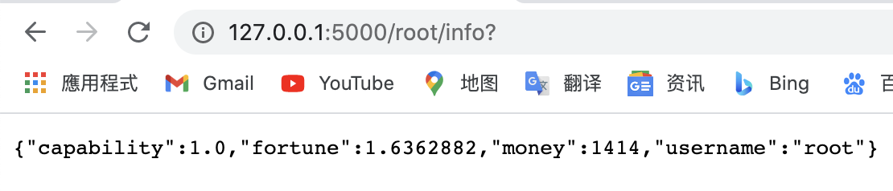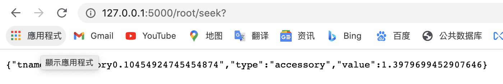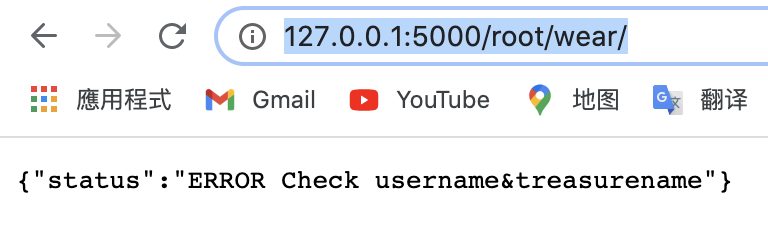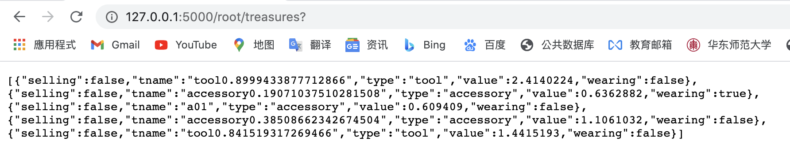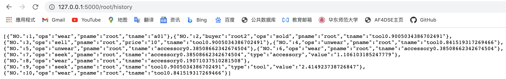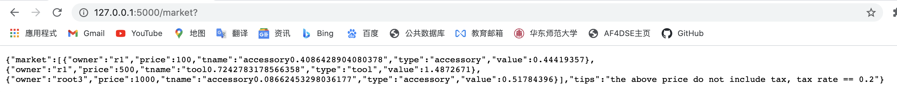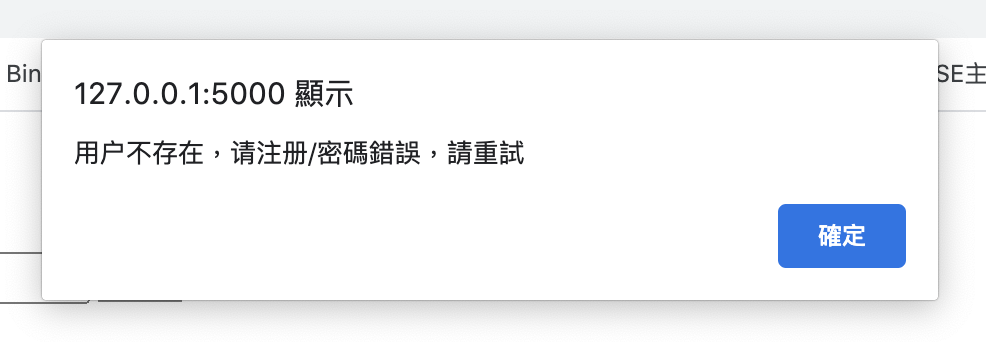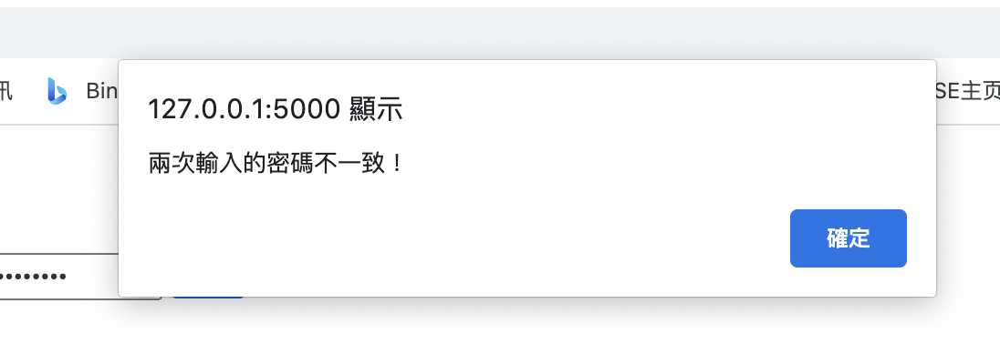

#### index

该路径为`"/"`，无参数，用于显示登陆及注册页面。如下图所示。

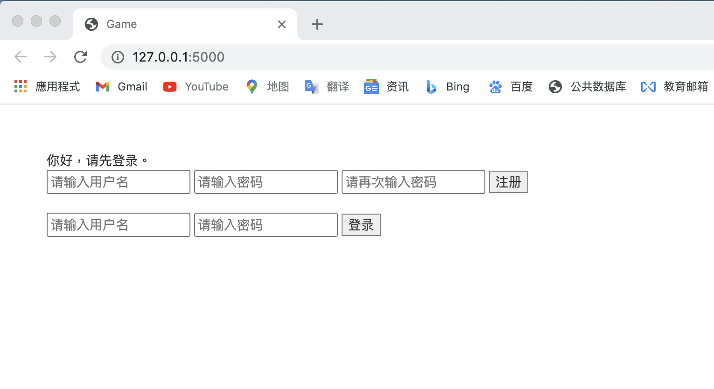

#### signup

该功能路径为`"/signup"`，函数名为`register`，参数为`username,password`，通过表单传入，用于注册账号。

#### login

该功能路径为`"/login"`，函数名为`login`，参数为`username,password`，通过表单传入，用于登录账号并显示该账号对应的operation.html页面。

#### operation

该功能路径为`"/operation/<string:username>"`，参数为`username`，用于显示用户可执行的各种操作。页面上每个按钮对应一个操作的链接。如下图所示。

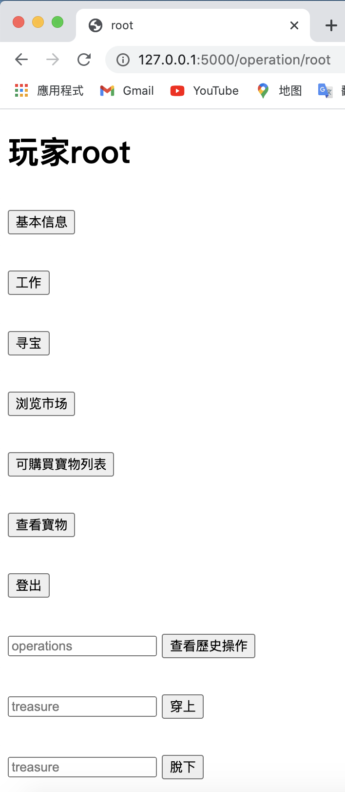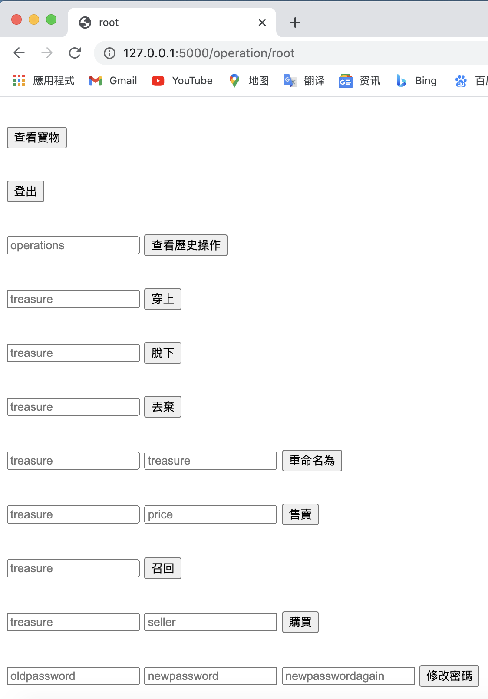

除上述路径之外，程序还提供了其他前端专用路径。由于内部实现与后端完全一致，在此不再赘述。

### 4. 测试设计

测试设计修改较少。pytest测试修改较少细节，postman测试有一些修改。新加入代码运行指南部分。

#### pytest测试

在我的代码中，我使用了pytest进行测试并计算覆盖率。由于前端网页专用的接口同样运行后端的代码，功能重复，将使用postman测试。所以没有计算前端网页专用的接口，此时覆盖率如图所示。

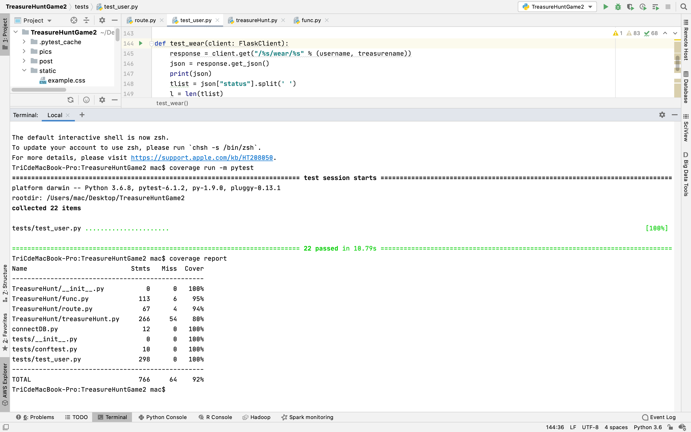

##### 插入类功能测试

对于`register, seek, work`这类将某项加入数据库的功能的测试主要在`test_register, test_seek_and_rename, test_work, test_wrong_1`中。主要测试了注册成功，注册时重名，寻宝工具成功，寻宝配饰成功，工作成功，距离上次工作或寻宝未满一天，用户名错误等场景。

##### 查找类功能测试

对于`info, treasures, market`等需要返回具体信息的功能的测试主要在`test_info, test_market, test_treasures, test_more_treasures, test_my_market, test_wrong_1`中。主要测试了以下场景：查看基本信息成功，查看市场成功，查看宝物成功，查看宝物详细信息成功，筛选可购买宝物成功，查看历史记录成功，以及各种因用户名错误而失败的各种场景。这类操作属于查询信息，即使失败仍然有可能返回有用信息或空列表。

##### 修改类功能测试

对于`login, logout, changepw, rename, wear, unwear, sell, callback, sold`等需要大量修改数据库内信息的功能的测试主要在`test_wear, test_unwear, test_sell, test_callback, test_buy, test_seek_and_rename, test_wrong_2, test_wrong_3, test_login, test_logout, test_changepw`中。主要测试了以下场景：登录成功，登录时密码错误，登出成功，修改密码时原密码输入错误，修改密码成功改名成功，宝物名已被使用，穿戴工具类宝物成功，穿戴配饰类宝物成功，脱下宝物成功，重复穿戴宝物失败，脱下未穿戴的宝物失败，上架已穿戴的宝物失败，上架宝物成功，下架宝物成功，穿上已挂牌宝物失败，更改宝物价格，购买宝物成功，金钱不足购买失败，购买自己宝物失败以及各种因用户名不存在，宝物不存在，宝物不属于该用户而失败的各种场景。

##### 删除类功能测试

对于`drop, remove`等不可撤销地从数据库中删除一个或几个文档的测试主要在`test_drop, test_remove, test_wrong_3`中。主要测试了以下场景：丢弃宝物成功，注销账号成功，注销不存在的账号失败以及各种因用户名不存在，宝物不存在，宝物不属于该用户而失败的场景。

#### postman测试

除pytest以外，我还使用了postman对一些不易被测试到的情形进行了测试。以下是部分测试的截图。按顺序执行以下操作对查询类操作和特殊情形进行测试。

下图是查询我的宝物测试，返回的数据格式如图。可以看到此时穿着两件配饰一件工具。

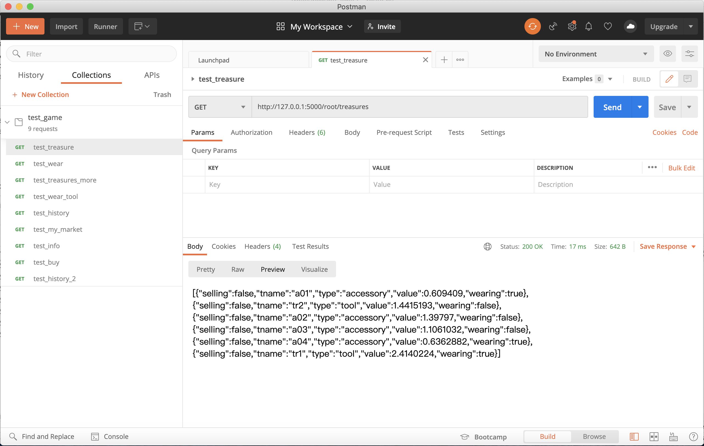

测试替换配饰的功能。然后穿上宝物tr4，返回状态为成功。

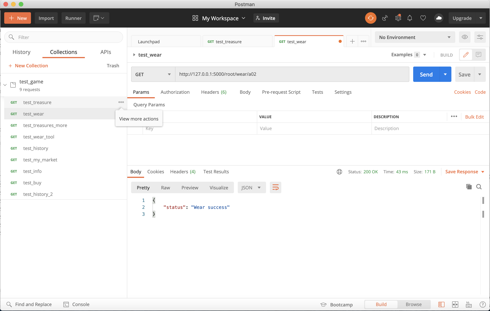

测试显示宝物信息功能。可以看到宝物a02替换了原来运气值最小的宝物a01。替换配饰执行正确。

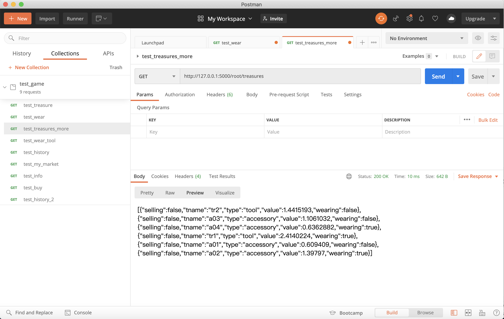

测试替换工具的功能。穿戴工具宝物tr2。

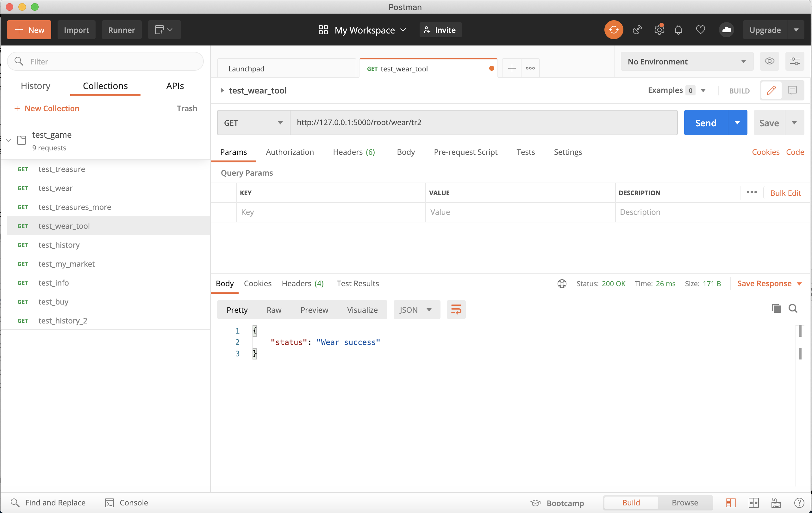

测试显示宝物信息功能。可以看到工具tr2替换了原有的工具tr1。替换执行正确。

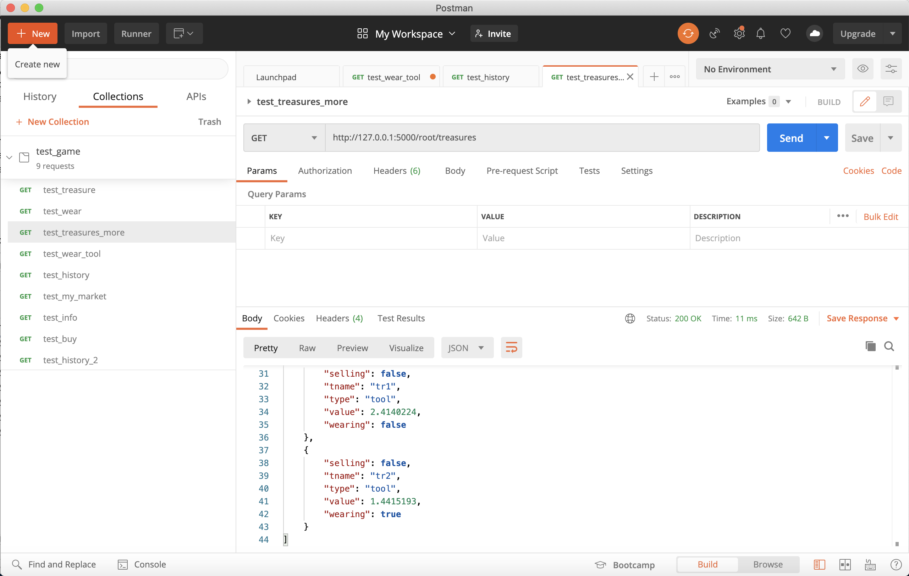

测试显示可购买宝物功能，返回格式如图。显示的价格为500金钱。

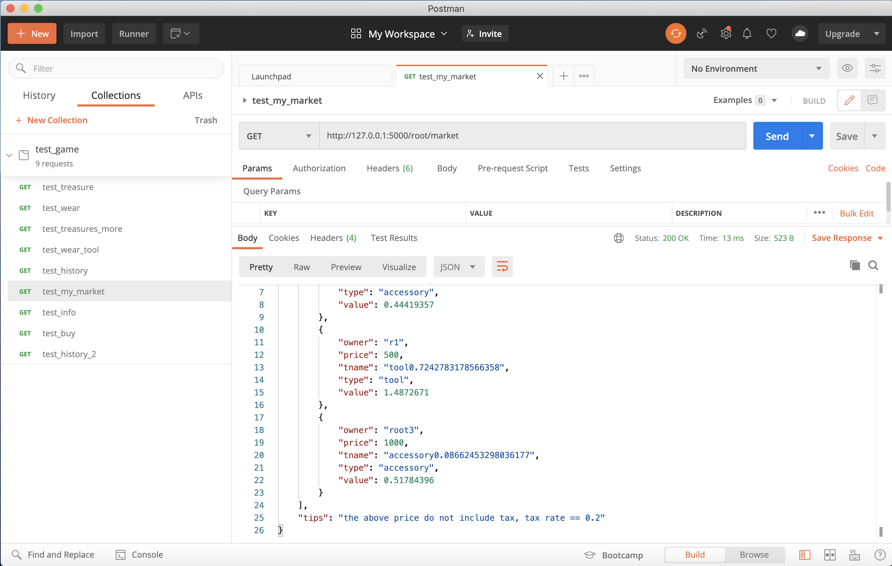

测试显示基本信息功能，返回格式如图。金钱充足可以购买。


测试购买功能，显示购买成功。

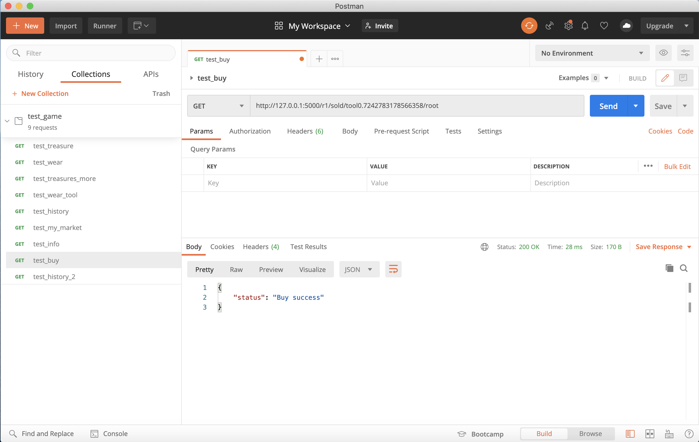

查看显示基本信息功能确实购买成功，金钱减少600是因为有20%流转税的缘故，在市场页面有说明。

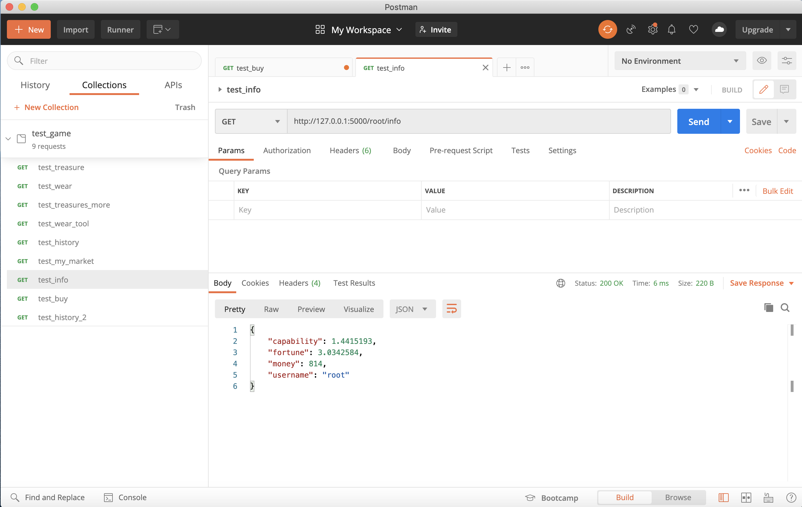

#### 代码运行指南

在运行代码之前，需要手动建立数据库和表，在建立好数据库之后，输入以下指令创建4张表。

```sql
create table players(
pname varchar(64) primary key,
passwd char(32) not null,
money int not null default 1000 check (money>=0),
capability real not null default 1.0,
fortune real not null default 1.0,
lasttime numeric(16,6) not null default 0 check (lasttime>=0),
login boolean not null default false
);
```

```sql
create table treasures(
tname varchar(64),
type varchar(10) not null check (type='tool' or type ='accessory'),
value real not null,
owner varchar(64),
wearing boolean not null default false,
price int check (price>=0),
primary key (owner,tname),
foreign key (owner) references players(pname)
);
```

```sql
create table logs(
ops varchar(10) not null,
time numeric(16,6) primary key check (time>=0),
pname varchar(64) not null,
tname varchar(64),
overflow boolean not null default false
);
```

```sql
create table logs_overflow(
time numeric(16,6),
attr varchar(64),
value varchar(64) not null,
primary key (time,attr),
foreign key (time) references logs(time)
);
```

然后建立视图和索引。

```sql
create view market 
as
select * from treasures
where price is not null;
```

```sql
create index priceindex on treasures(price);
```

```sql
create index playerindex on logs(pname);
```

现在已经初始化完毕，初始化结果如图，可以运行app.py程序来启动游戏服务器。

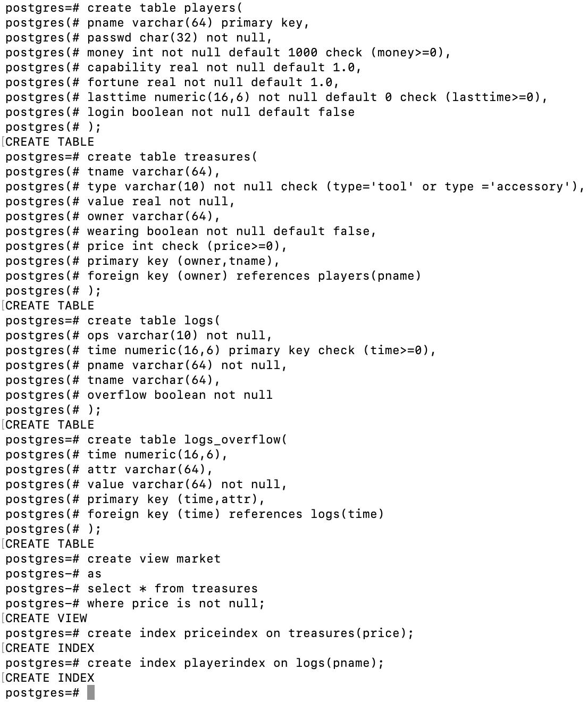

利用pytest测试时，只需保证数据库中没有用户名为test，test2，test3的用户即可。在此情况下，可以通过全部pytest测试。由于生成宝物种类随机，pytest需要等待找到两种宝物后才会继续运行，请耐心等待。

## 五、总结

### 重要更新

- 将后台数据库改为postgresql
- 提高系统安全性，加入了密码系统和登入登出系统，同时修改前端，使其支持密码验证
- 修改游戏规则，不同用户可拥有名称相同的物品，但同一用户不可拥有同名物品
- 增加功能，宝物在穿戴或售卖时也可进行改名或丢弃的操作
- 对新接口增加了相应的pytest测试代码
- 修复了一些小bug

### 总结与感想

通过这次实验，我学会了使用postgresql搭建一个项目。在这个项目中，我熟练使用了SQL的增删改查操作，并且学会了利用sqlacademy中提供的接口来对关系型数据库进行访问。并且，我了解了对象和数据库之间的关系，学会了使用ORM工具访问数据库。

在本次实验中，我依然将大部分精力放在了对后端的性能的优化上。对于同样的操作，访问数据库的复杂度可以有很大的差异。而关系型数据库的性能主要取决于执行I/O的次数。**以下是我在性能优化中获得的经验。**

1. 对于比较复杂的需要使用连接操作或者聚集函数的SQL访问，可以添加推导属性。
2. 要减少多次细粒度的查询。尤其是使用聚簇索引查询相邻数据时，更应一次全部拿出。
3. 在访问数据库时，使用索引的查询操作耗时很短，而去重的投影和连接耗时较长。可以将后者用另一种方式表达，但也要考虑内存大小因素。
4. 在进行错误处理时，要尽量选择较少访问数据库的方式。
5. 可以使用SQL中提供的returning关键字，直接取出更新后或删除前的数据，这个功能类似pymongo提供的查找并更新，查找并删除等操作。
6. 建立适当的索引，视图来加速查询。索引更适合建在那些不同值数量多，且排列次序有意义的值上。视图应建在常用的指令上，并根据情况建立物化视图。
7. 在进行调试时，合理的CHECK约束可以更快地锁定错误。

**功能和性能的对立统一**在本次数据库作业中体现的更加明显。日志功能对于每次非查询类的操作都增加了一两次对数据库的访问，但它对用户的使用和数据的恢复有重要的作用。检查用户的登录状态看似没有必要，实际上提高了系统的安全性。如果去掉这些，虽提高了性能，却让用户的使用体验变差了。

这次新增的内容更多地考虑了**安全性**的问题，即用户的恶意访问。所以为用户设计了密码和登录状态这两项功能，从理论上让他们只能访问自己的数据。并且密码采用了密文存储，防止在被数据库攻击的情况下泄漏密码。虽然已经考虑了这些问题，但目前的设计仍有漏洞。还需通过其他方法提高安全性。

由于时间和水平有限，本项目还存在许多不足之处，万望海涵。最后，感谢牛学长百忙之中的指导，感谢老师和助教们的日复一日不辞辛劳的讲解和付出，您们辛苦了，谢谢您们！